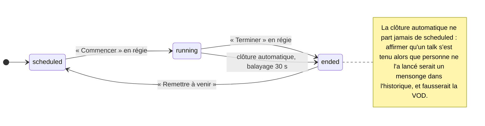
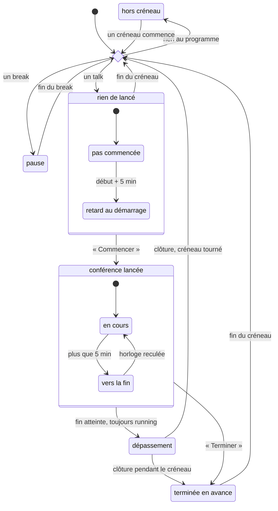

# Cloud Nord — Régie de salle & Hub

Régie d'événement — projection des slides, captation d'un master déjà habillé
pour la VOD, streaming live, bascule vers sponsors et programme entre les
interventions, mur social. Écrit pour **Cloud Nord 2026** (30/10/2026, 3 salles),
mais **le dépôt ne connaît pas l'événement qu'il sert** : le hub le déduit du
programme importé, et le nom se corrige dans la console — voir
[Servir un autre événement](#servir-un-autre-événement).

Deux applications :

- **hub** (cloud) — importe le programme, diffuse salles et commandes, collecte les
  interactions sociales et la télémétrie ;
- **room-client** (Electron, un par salle) — pilote deux instances OBS, sert l'écran
  de salle, et **fonctionne seul** : réseau coupé, la régie continue et rien n'est perdu.

La structure du dépôt est décrite plus bas, et les choix qui ne se devinent pas
à la lecture du code sont réunis dans « Décisions structurantes ». Pour
contribuer : [CONTRIBUTING.md](CONTRIBUTING.md).

## État

| Lot | Contenu | État |
|---|---|---|
| 0 | Fondations : monorepo, contrat, schémas, parseur programme | ✅ |
| 1 | Squelette bout-en-bout (hub + client + OBS-A) | ✅ |
| — | Fenêtre de régie (contrôles opérateur) | ✅ |
| 2 | Résilience : outbox/inbox, cache d'assets, horloge | ✅ |
| 3 | Chaîne OBS complète : OBS-B, VOD, sidecars, streaming | ✅ |
| 4 | Social : mur, Q&A, modération, console hub | ✅ |
| 5 | Exploitation : packaging, supervision, runbook | ✅ (répétition à faire) |
| 6 | Console du hub en Vue 3 — huit vues, socle partagé | ✅ |

## Structure

```
packages/program    parseur/normaliseur de l'export « conference-center » + sélecteurs par salle
packages/etat-salle automate d'une salle : états, transitions, apparence — partagé hub ↔ régie
packages/contract   contrat oRPC v2 (zod) : procédures, événements, commandes
packages/db         schémas Drizzle + migrations (hub et client), helper SQLite
packages/format     formateurs partagés : durées, instants, tailles, échappement
packages/hub-client client oRPC typé, côté navigateur : jeton, session expirée
packages/components composants Vue : primitives Reka retravaillées + design system
apps/hub-server     Fastify + oRPC + SQLite + Better Auth : programme, salles, commandes, appairage
                    sert /mur (gabarit) et la coquille de la console
apps/hub-admin      console d'exploitation — Vue 3 + Vite, servie par le hub
apps/room-client    Electron — écran de salle, pilotage OBS, appairage, cache local
spikes/orpc-v2      spike jetable de validation des adapters — voir FINDINGS.md
spikes/vue-tsc      pourquoi les paquets front épinglent TypeScript 6 — voir FINDINGS.md
```

## Démarrer

```bash
corepack enable && pnpm install
pnpm test            # 1227 tests
pnpm typecheck
```

## Lancer en local

**1. Configurer le hub**

```bash
cd apps/hub-server
cp .env.example .env
# renseigner BETTER_AUTH_SECRET :
openssl rand -base64 48
```

**2. Créer un compte opérateur.** L'inscription publique est fermée : sans cette
étape, la console est inaccessible et personne ne peut appairer une machine.

```bash
pnpm --filter @cloudnord/hub-server operator regie@cloudnord.fr "Régie" <mot-de-passe>
```

**Ce compte reste nécessaire même avec Google** (ci-dessous) : Google exige
internet au moment de la connexion, et tout ce système est bâti pour survivre à
une coupure. Un hub qui ne s'ouvre que par Google enferme l'équipe dehors
exactement le matin où le réseau tombe.

### Connexion Google Workspace

Facultative, et **tout compte du domaine autorisé est un opérateur** — c'est
l'annuaire qui fait la liste, personne n'a de compte à provisionner le matin de
l'événement.

Dans la console Google Cloud : un client OAuth « Application Web », avec
`<PUBLIC_URL>/api/auth/callback/google` en URI de redirection autorisée (plus
`http://localhost:8787/api/auth/callback/google` pour le développement — Google
n'accepte `http` que sur localhost). Écran de consentement en **Internal** si le
domaine est bien un Workspace : c'est une barrière de plus, gratuite.

Puis dans le `.env` du hub :

```bash
GOOGLE_CLIENT_ID=…apps.googleusercontent.com
GOOGLE_CLIENT_SECRET=…
GOOGLE_HOSTED_DOMAIN=votre-domaine.fr
```

`GOOGLE_HOSTED_DOMAIN` n'a **pas de défaut** et devient obligatoire dès que
`GOOGLE_CLIENT_ID` est renseigné : le hub refuse de démarrer plutôt que de
deviner qui a le droit d'entrer. Un domaine de repli écrit dans le code
n'appartiendrait qu'à un organisateur, et ouvrirait la console d'un autre
événement à son personnel.

Le domaine est **envoyé à Google comme indice `hd` *et* revérifié contre la
revendication du jeton d'identité** au retour. L'indice seul ne serait qu'une
préférence d'écran de choix de compte, qu'un compte personnel contourne ; c'est
la seconde vérification qui tient la frontière.

Les deux identifiants vont par paire : n'en renseigner qu'un **empêche le hub de
démarrer**, plutôt que de monter une console dont le bouton échoue à chaque clic.
Le bouton n'apparaît que si le hub sait s'en servir, et le mot de passe reste
au-dessus, toujours.

**3. Lancer le hub**

```bash
pnpm --filter @cloudnord/hub-server dev
```

Au premier démarrage il importe le programme depuis `PROGRAM_SOURCE_URL` et
**crée les trois salles à partir de `event.tracks[]`**. Cette variable n'amorce
que la première fois : l'URL devient ensuite le réglage « Source du programme »
de la console, modifiable sans redémarrer et utilisé par « Réimporter ». La console est sur
<http://localhost:8787/admin>, le mur public sur
<http://localhost:8787/mur?salle=track-1-teilhard-de-chardin>.

**4. Lancer un client de salle**

Deux façons, selon qu'on a une interface graphique ou non.

**Sans Electron ni OBS** — recommandé pour développer, notamment sous WSL, en
conteneur ou sur une machine distante :

```bash
cd apps/room-client
HUB_ORIGIN=http://localhost:8787 HEURE_SIMULEE=2026-10-30T10:20:00Z pnpm dev:headless
```

Les pages s'ouvrent dans un navigateur : `/regie`, `/display/projector`,
`/display/overlay` sur le port affiché. Toute la logique du client vit hors
Electron, c'est ce qui rend ce mode possible.

**Avec Electron** :

```bash
MODE=dev HUB_ORIGIN=http://localhost:8787 pnpm --filter @cloudnord/room-client dev
```

Sans `HUB_ORIGIN` ni `--hub`, l'application **demande l'adresse du hub** dans une
petite fenêtre à chaque démarrage — voir « L'adresse du hub » plus bas.

Dans les deux cas, le client affiche un **code d'appairage** : le saisir dans la
console (« Machines en attente »), choisir une salle, approuver.

### `MODE=dev` : les commodités de développement

**Un seul interrupteur par côté**, hub et salle, et c'est lui qui commande tout
le reste. Le défaut est `production` — le défaut doit être le cas dangereux, pas
le cas confortable.

**Les deux applications, deux terminaux** — la façon recommandée, et la seule
qui marche sous WSL sans serveur X :

```bash
# 1 — le hub
MODE=dev pnpm --filter @cloudnord/hub-server dev

# 2 — une salle, sans Electron ni OBS
HUB_ORIGIN=http://localhost:8787 pnpm --filter @cloudnord/room-client dev:headless
```

`dev:headless` se met de lui-même en `MODE=dev` : c'est ce qu'il sert à faire.
Avec Electron, à la place du second terminal :

```bash
MODE=dev HUB_ORIGIN=http://localhost:8787 pnpm --filter @cloudnord/room-client dev
```

**Ou les deux d'un coup**, depuis la racine — turbo lance le hub *et* le client
Electron :

```bash
MODE=dev pnpm dev
```

Deux choses à savoir sur cette forme. Turbo 2 filtre l'environnement des tâches
(mode « strict ») : les variables de développement sont donc déclarées en
`passThroughEnv` dans `turbo.json`, sans quoi `MODE=dev` n'atteindrait aucune
des deux applications et les deux démarreraient en production **sans un mot**.
Et le client lancé est celui d'Electron : sous WSL sans serveur X, aucune
fenêtre ne s'ouvre — les deux terminaux ci-dessus valent mieux.

Une variable posée sur la ligne de commande l'emporte sur le `.env` : garder
`MODE=production` dans `apps/hub-server/.env` n'empêche pas `MODE=dev pnpm …`
de fonctionner.

**Le hub et les salles d'un seul terminal**, sans Electron :

```bash
pnpm dev:duo    # hub + une salle   (7788)
pnpm dev:trio   # hub + deux salles (7788 et 7789)
```

Une salle suffit pour développer une régie. Il en faut deux dès qu'on touche à
ce qui est commun à l'événement — le mur des questions, un message poussé depuis
la console, la modération : ces bugs-là ne se voient pas à une salle.

Chaque salle a son `DATA_DIR`, donc sa propre identité machine, et son
`ROOM_ID`, ce qui évite l'écran de choix de salle : elles affichent directement
leur code d'appairage. `HUB_ORIGIN`, `SALLE_1`, `SALLE_2`, `PORT_1` et `PORT_2`
restent réglables. Ctrl-C arrête tout le monde, en laissant au hub le temps de
refermer sa base (voir « Arrêt du hub »).

**Repartir d'un environnement vierge** — applications arrêtées :

```bash
pnpm raz:dev          # liste ce qui part, demande confirmation
pnpm raz:dev --oui    # sans la question
```

Efface la base du hub (`apps/hub-server/data/`), celles des salles headless
(`apps/room-client/.donnees-locales/`) et, pour la salle Electron, les seuls
fichiers qu'elle écrit dans le dossier de données du système — base, identité
machine, jeton, adresse du hub mémorisée, cache d'assets, captations simulées.
Le dossier lui-même n'est pas supprimé : hors empaquetage, Electron le nomme
« Electron » et le partage avec toute autre application Electron de la machine.

Les `.env`, les migrations et les sorties de build ne sont pas touchés. Après
coup, les salles devront être réapprouvées dans la console, et le hub réimportera
le programme depuis `PROGRAM_SOURCE_URL` à son premier démarrage.

**Pour dérouler la journée du 30 octobre**, ajouter l'heure sur le hub — les
salles s'alignent, il n'y a rien à régler de leur côté :

```bash
MODE=dev SIMULATED_TIME=2026-10-30T10:20:00Z pnpm --filter @cloudnord/hub-server dev
```

Hors de ce mode, les réglages ci-dessous sont **neutralisés même s'ils sont
renseignés**, et chaque poste le dit bruyamment : journal en erreur, bandeau
rouge dans la console du hub. Ils ne font pas échouer le démarrage — un hub qui
refuse de repartir en cours d'événement parce qu'une ligne traîne dans un
`.env` serait pire que le mal qu'on soigne. C'est là tout l'intérêt : un
`OBS_MOCK=1` oublié dans un raccourci, c'est une journée entière filmée par une
instance OBS qui n'existe pas, et la panne se découvre au montage.

| Variable | Côté | Effet, **en `MODE=dev` seulement** |
|---|---|---|
| `SIMULATED_TIME` | hub | Place **tout le système** à un instant de l'événement. Les salles s'alignent sur `serverTime`, il n'y a rien à régler de leur côté. C'est la bonne façon de dérouler la journée du 30/10 dès maintenant. |
| *(par le mode)* | hub | Le **réglage de l'heure depuis la console** (onglet Réglages) : sélecteur de date, raccourcis vers les moments clés, retour à l'heure réelle. Ouvert en dev, fermé en production. |
| *(par le mode)* | hub | La **remise à zéro des données** (onglet Développement) : vide le préfixe du bucket et les rushes des salles. Refusée côté serveur en production, et pas seulement absente de la console. |
| `HEURE_SIMULEE` | salle | Heure locale, pour développer **sans hub**. Posée comme un *décalage* sur l'horloge machine, exactement comme le fera le hub : dès qu'il répond, son heure remplace la valeur, sans que les deux se cumulent. Pour dérouler une journée, préférer `SIMULATED_TIME` sur le hub — les salles s'alignent seules. |
| *(par le mode)* | salle | **OBS est simulé** : scènes, enregistrement, diffusion. Écrit un **vrai fichier** à l'arrêt, donc la chaîne VOD va jusqu'au sidecar. `OBS_REEL=1` parle à de vraies instances à la place. |

**Deux variables ont disparu** : `CLOCK_CONTROL` et `OBS_MOCK`. Chacune
doublait le mode par un second interrupteur, ce qui laissait exister des
combinaisons absurdes — un hub de production dont on pouvait quand même
déplacer l'horloge. Les trouver dans un `.env` ou un raccourci ne fait plus
rien, et chaque poste le dit en nommant son remplaçant : le silence est ce
qu'on cherche à éviter, pas la variable.

Les réglages qui n'ont rien de dangereux restent libres : `DISPLAY_PORT` (port
du serveur local, défaut 7788), `DATA_DIR`, `ROOM_ID`, `HUB_ORIGIN`.

### L'adresse du hub

Sur un poste de salle, l'application se lance depuis un raccourci du bureau posé
par l'installeur : personne n'ira y éditer une variable d'environnement la veille
de l'événement. Le client Electron **demande donc l'adresse du hub à chaque
démarrage**, dans une fenêtre qui précède tout le reste, avec la dernière adresse
retenue déjà dans le champ — valider repart sur le même hub, et rebrancher la
salle ailleurs (répétition, hub de secours, poste déplacé) ne demande rien de
plus qu'une saisie. Un lancement de plus coûte une touche Entrée ; se tromper de
hub coûte une demi-journée de captation envoyée au mauvais événement.

Deux sources la dictent et sautent la fenêtre — un raccourci ou un script n'a
personne pour répondre à une question :

| Source | Ce à quoi elle sert |
|---|---|
| `--hub=<url>` sur la ligne de commande | provisionner un poste, ou le déployer en série |
| `HUB_ORIGIN` dans l'environnement | développer, et `pnpm dev` |

Le champ pardonne ce qu'on tape vraiment sur un poste de salle : un schéma
manquant est complété en `http://`, un chemin collé par erreur est retiré, et le
hub est sondé au fil de la frappe **sans jamais bloquer « Continuer »** — un poste
se prépare la veille, hub éteint, et rejoint tout seul le lendemain.

L'adresse retenue est mémorisée dans `hub`, à côté de `client-id`, dans le dossier
de données de l'application — hors base SQLite, comme l'identité de la machine :
une remise à zéro du cache ne doit pas faire oublier au poste où était son hub.
Une adresse dictée est mémorisée elle aussi : elle devient la proposition du
lancement suivant.

**Les deux côtés se surveillent.** Le hub annonce son mode à chaque `sync` ; la
salle le compare au sien et affiche un badge en régie : `MODE DEV` en ambre
quand tout le monde est d'accord, **`DEV · HUB EN PRODUCTION`** en rouge sinon.
Une salle de développement branchée sur le hub de l'événement enverrait de
vraies commandes depuis un poste qui simule tout — c'est exactement ce qu'on
veut voir de loin. La console du hub porte le même badge, rendu côté serveur.

Un talk complet avec OBS simulé produit exactement ce qu'il produirait en salle :

```
2026-10-30_track-1-teilhard_1100_honeyswamp-active-defense-to-ruin-attackers.mkv
2026-10-30_track-1-teilhard_1100_honeyswamp-active-defense-to-ruin-attackers.json
   titre     : HoneySwamp: Active Defense to Ruin Attackers
   speakers  : Steven LE ROUX
   catégorie : Sécurité
   marqueurs : ['début de la démo']
```

### Sous WSL

Les erreurs `dbus` d'Electron sont du bruit sans conséquence. L'avertissement
« Chiffrement indisponible — jeton stocké en clair » est attendu : il n'y a pas
de trousseau système, et l'application le dit plutôt que de le taire. Si aucune
fenêtre ne s'ouvre (pas de serveur X), utiliser `dev:headless`.

**Voir les pages sans rien lancer** :

```bash
pnpm --filter @cloudnord/room-client preview ./apercu
```

Rejouer le spike de validation oRPC :

```bash
pnpm --filter @cloudnord/spike-orpc-v2 spike     # 8/8 attendus
```

Régénérer les migrations après modification d'un schéma :

```bash
pnpm --filter @cloudnord/db generate:hub
pnpm --filter @cloudnord/db generate:client
```

## Voir l'écran de salle

```bash
pnpm --filter @cloudnord/room-client preview ./apercu
```

Génère les pages réelles — écran de salle dans ses quatre modes, habillage de
captation, fenêtre de régie — avec les vraies données de l'événement.

Le client sert trois surfaces sur son serveur local :

| URL | Usage |
|---|---|
| `/display/projector` | Browser Source d'OBS-A, ou fenêtre plein écran de secours |
| `/display/overlay` | Browser Source transparente d'OBS-B (habillage VOD, question du public) |
| `/display/overlay-live` | Browser Source transparente d'OBS-A — question du public et messages de la console |
| `/regie` | Fenêtre de l'opérateur : scènes, enregistrement, marqueurs, diagnostic |

### La régie est un bundle, pas une page

`/regie` charge un bundle construit depuis `apps/regie-web`. Le poste rend
toujours la coquille lui-même, avec l'état complet de la salle dedans : un F5
en régie arrive presque toujours au pire moment — la fenêtre a gelé, et c'est
en plein talk — et attendre le premier message du flux donnerait une
demi-seconde d'écran vide à cet instant-là.

En production le bundle voyage dans l'installeur ; depuis les sources il faut
le construire, sans quoi l'adresse répond 503 en le disant :

```bash
pnpm --filter @cloudnord/regie-web build
```

Pour la développer avec rechargement à chaud, le poste proxifie Vite — jamais
l'inverse : c'est lui qui porte le flux d'état, les actions et le vumètre.

```bash
pnpm --filter @cloudnord/regie-web dev          # dans un terminal
REGIE_VITE_ORIGIN=http://127.0.0.1:5174 pnpm dev:headless   # dans l'autre
```

## L'écran d'attente : une boucle

`loop` est le mode d'écran par défaut d'une salle — celui qu'on veut y trouver
le matin sans que personne n'ait rien touché, et celui sur lequel on retombe
quand un message s'efface. Il enchaîne quatre pages :

| Page | Durée | Ce qu'elle apporte |
|---|---|---|
| Nos partenaires | 12 s | Le palier de tête en grand, les autres engagements dessous |
| Programme de la salle | 15 s | La journée, du créneau en cours vers la suite |
| Pendant ce temps, à côté | 12 s | Le talk en cours ou à venir des **autres** salles |
| Suivez *\<événement\>* | 10 s | Les comptes de l'organisateur, handle en grand |

Un cycle complet fait 49 secondes. Les durées ne sont pas égales : un programme
de vingt-sept lignes se lit, une rangée de logos se regarde. Elles sont
volontairement longues — un écran qui change toutes les trois secondes attire
l'œil pendant une pause où les gens se parlent. Les points en bas disent qu'il y
a une suite, et qu'elle tourne : sans eux, un écran qui change tout seul se lit
comme un écran instable. Le point actif se remplit sur la durée de la page, ce
qui dit en plus *quand* elle va tourner.

**Les partenaires sont en podium.** Le premier palier — celui qui a payé le
plus cher, et les paliers arrivent déjà triés par rang — occupe seul un bandeau
doré en haut de l'écran, logos au plus grand. L'or ne vient pas du thème de
l'événement, et c'est voulu : la marque habille l'écran, l'or dit le rang. Tant
que le bandeau reprenait la couleur de marque, le palier de tête se lisait comme
un encadré de plus. Il se déclenche sur le **rang**, jamais sur le nom du
palier : « Gold » peut devenir « Platine » d'une édition à l'autre, le premier
reste le premier. Tout le reste est fondu en une rangée
où chaque sponsor n'apparaît **qu'une fois**, avec la liste des packs qu'il a
pris ; ceux qui s'en sont offert plusieurs y ont une carte plus large, encadrée
de la couleur de marque, sous l'intitulé « Et sur tous les fronts ».

La hiérarchie est portée par le cadre, jamais par la taille du logo : dans une
rangée, toutes les pastilles partagent la même hauteur et la même ligne, et
toutes les légendes le même appui. Faire maigrir le logo de celui qui n'a pris
qu'un pack cassait la ligne — une rangée de partenaires se lit comme une
étagère, ou ne se lit pas.

**Les logos sont détourés à l'affichage.** Les sponsors déposent ce qu'ils
veulent : certains fichiers sont cadrés au plus près, d'autres laissent flotter
la marque au milieu d'une grande marge. Posés côte à côte à hauteur égale, les
seconds paraissent deux fois plus petits — c'est du vide qu'on affiche à leur
place. La page mesure donc l'encre de chaque logo et recadre dessus, une fois
par image, gardée ensuite en mémoire.

Deux garde-fous. Seules les marges **transparentes ou blanches** sont rognées :
un logo posé sur un aplat de couleur — le carré bleu d'AXA — a cet aplat pour
marque, et le resserrer sur le texte qu'il contient l'abîmerait. Et le calcul
n'est possible que parce que les images du cache sont servies par le client
lui-même sur `/assets` : un logo encore distant invalide le canvas, la lecture
lève, et l'image est gardée telle quelle.

Le dédoublonnage ne peut pas passer par l'identifiant : l'export amont en donne
un **par palier**, si bien qu'un même partenaire en porte autant que de packs
pris. C'est le site qui sert de clé, à la barre finale près, et le nom en repli.
Sans cela le même logo revenait à l'identique à trois lignes d'écart — projeté,
cela se lit comme un défaut d'affichage, pas comme de la générosité.

**Elle est animée, sobrement.** Deux pages se croisent en fondu — la sortante
s'efface par-dessus la nouvelle qui entre — les listes arrivent ligne à ligne
plutôt que d'un bloc, le programme part du créneau en cours et glisse vers la
suite de la journée pendant qu'il est affiché, et le halo de marque dérive en
quarante-quatre secondes derrière tout cela. Rien de tout ceci n'anime autre
chose qu'`opacity` et `transform` : ce sont les deux propriétés qu'un
compositeur traite sans repasser par la mise en page, seule façon de tenir dans
une Browser Source OBS en 4K. Un écran de pause parfaitement immobile pendant
vingt minutes finit par se lire comme un poste éteint sur une image.

**Une page sans contenu est sautée, pas affichée vide** : dix secondes de cadre
désert devant la salle se lisent comme une panne. Une salle jamais synchronisée
se réduit donc aux sponsors, exactement comme avant.

Les modes `sponsors` et `programme` restent disponibles seuls : quand quelque
chose se passe, on veut pouvoir figer l'écran sur une page précise plutôt que
d'attendre que la boucle y revienne.

### Ce qui alimente les deux pages nouvelles

**Les autres salles** sont calculées par la salle elle-même, sur le programme
déjà en cache et l'horloge corrigée du hub — jamais sur l'heure du poste, qui
peut en être à des semaines quand le hub tourne sur une horloge simulée. Aucun
appel réseau : la boucle tourne pendant les pauses, c'est-à-dire quand le réseau
de l'événement est le plus chargé. Les pauses des autres salles sont écartées —
« Déjeuner en Track #2 » n'aide personne à choisir où aller.

**Les comptes de l'organisateur** sont un réglage du hub (console, onglet
*Réglages*, panneau « Nos réseaux »), poussé aux salles au `sync` et **mis en
cache local** comme le programme. L'export amont ne porte que les réseaux des
*speakers* : ceux de l'événement n'ont aucune source, et corriger un handle ne
doit pas demander de rejouer une release sur les trois machines de salle. Le nom
écrit au-dessus (« Suivez … ») vient de la même descente, et suit l'événement.

## Servir un autre événement

Le dépôt ne connaît pas l'événement qu'il sert. Le hub **déduit son identité du
programme importé** — `event.name` de l'export « conference-center » — et la
descend à tout le reste : mur public, console, notifications poussées, titres
des fenêtres de salle, boucle d'attente projetée. Changer d'édition, ou
d'événement, tient donc en un geste :

```
Console → Réglages → Programme → URL de l'export → Enregistrer → Réimporter
```

Rien d'autre à faire : aucune variable d'environnement, aucune release à
rejouer sur les machines de salle. Les salles reçoivent le nouveau nom au `sync`
suivant et le gardent en cache local — une salle qui redémarre hub injoignable
titre quand même correctement.

**Ce qui se règle à la main** — console, onglet *Réglages*, panneau
« L'événement » — n'existe que pour les cas que l'export ne couvre pas :

| Réglage | À quoi il sert | Vide = |
|---|---|---|
| Nom affiché | Contredire un export qui porte un nom interne (« CN26-prod ») | Le nom du programme importé |
| Nom court | Corriger la déduction là où la place manque (fenêtres, notifications) | Le nom complet, millésime retiré |
| Projet OpenFeedback | Fabriquer les QR « notez ce talk » hors ligne | Aucun QR — voir plus bas |

Les champs laissés vides montrent en `placeholder` ce que le hub a déduit : on
voit donc ce qu'on obtient en vidant un champ, ce qui est la condition pour
oser le vider. Le nom court retire un millésime reconnaissable en fin de nom
(« Cloud Nord 2026 » → « Cloud Nord », « DevFest Lille #12 » → « DevFest
Lille ») et rend le nom inchangé dès qu'il n'est sûr de rien : un nom court faux
se lirait sur chaque écran de la journée, un nom court trop long ne se remarque
pas.

**Ce qui reste au nom de Cloud Nord, et pourquoi.** Le scope npm
(`@cloudnord/*`), l'`appId` du paquet Electron (`fr.cloudnord.roomclient`) et le
copyright nomment le **logiciel** et son éditeur, pas l'événement projeté :
rien de tout cela ne s'affiche devant une salle. L'`appId` en particulier ne se
renomme pas à la légère — Electron en dérive le dossier `userData`, donc la base
locale d'une machine de salle : son cache de programme et sa file de remontée
non vidée.

Le reste de ce README décrit l'édition 2026 parce que c'est celle sur laquelle
tout a été éprouvé ; les chemins, identifiants de track et horaires cités sont
des exemples, pas des constantes du code.

## Décisions structurantes

- **`event.tracks[]` de l'export amont = les salles.** Le programme d'une salle est
  un simple filtre `session.trackId === room.trackId`.
- **Peu de scènes OBS, un écran piloté par le web.** OBS-A n'a que `LIVE` (capture
  HDMI) et `HOLD` (une Browser Source). Sponsors, programme, compte à rebours et
  messages sont rendus par la page, pas par des scènes — changer de contenu ne
  demande jamais de toucher à OBS.
- **SQLite des deux côtés, instance hub unique.** Supprime Redis (fanout WebSocket
  en process), partage un seul ORM, et rend les tests exécutables sans conteneur.
- **oRPC v2 contract-first**, un contrat pour trois transports : HTTP, WebSocket,
  MessagePort/Electron. Version **épinglée** (beta) ; doc de référence `v2.orpc.dev`.
- **Le client n'est pas « en mode dégradé », il est autonome par défaut.** Aucune
  action de régie ne bloque sur le réseau : `emit()` écrit dans une file SQLite
  locale, la remontée se fait en tâche de fond.
- **Deux politiques de livraison, déduites du type d'événement.** `required`
  (enregistrements, marqueurs, scènes) rejoué 48 h ; `best-effort` (télémétrie)
  périmé en 30 s et collapsé par clé — une heure hors ligne laisse *un* heartbeat
  en file, pas 720.
- **Une machine de salle a ses propres droits, pas ceux d'un opérateur.** Le flux
  device authorization prouve qu'un opérateur a approuvé la machine ; elle échange
  aussitôt cette session contre un **jeton de salle** (`rt_…`, stocké haché côté
  hub) qui ne permet que sync, remontée, lecture de l'état des salles et cycle de
  vie de *ses* conférences. Ni import de programme, ni modération, ni appairage,
  ni réglages.
- **Un hub absent au démarrage ne condamne pas la salle.** Une boucle de
  supervision sonde le hub toutes les 15 s et rattrape ce qui a échoué :
  appairage, connexion, OBS. C'est l'ordre de démarrage le plus probable un matin
  d'événement — les salles s'allument avant que quiconque ait lancé le hub.
- **Une coupure passagère ne périme pas un code d'appairage.** Le sondage
  continue jusqu'à l'expiration réelle du code : perdre le code parce que le hub
  a redémarré obligerait l'opérateur à tout recommencer sans raison.
- **La salle se choisit sur l'écran de régie**, au premier démarrage. Le choix
  voyage dans le `scope` de la demande d'appairage ; la console le retrouve
  **pré-sélectionné**, tout en restant libre d'en changer. C'est l'opérateur de
  la salle qui sait où il se trouve, celui devant la console qui tranche.
  `ROOM_ID=<id>` court-circuite l'écran pour un poste provisionné d'avance.
- **Un jeton refusé relance l'appairage** au lieu de boucler : la régie affiche un
  écran avec le code à saisir dans la console, qui disparaît à l'approbation.
- **Le JavaScript des pages restées des gabarits est analysé par un test.** Il
  vit dans un template literal, où TypeScript ne voit qu'une chaîne : une
  apostrophe mal échappée y casse *toute* la page sans que rien ne proteste.
  Chaque page est parsée, et les comportements clés testés dans un DOM réel via
  happy-dom. C'est le prix de l'absence d'étape de build, et il se paie une fois.
- **Les pages d'affichage sont autonomes et sans étape de build.** Écran,
  overlays et mur s'ouvrent même quand tout le reste va mal, et se testent en
  HTTP.
- **La console du hub et la régie sont des applications Vue.** Toutes deux
  avaient dépassé le seuil où le gabarit littéral coûte plus qu'il ne rapporte —
  3 800 lignes pour la console, 3 150 pour la régie, dont l'essentiel en
  JavaScript qu'aucun compilateur ne voyait. Le processus qui les sert rend une
  coquille et sert le bundle. L'invariant d'autonomie n'est pas abandonné mais
  **reformulé** — aucune ressource hors de l'origine — parce que ce qu'il
  protégeait était le réseau, pas la balise : un asset servi par le processus
  qui sert déjà la page ne disparaît pas d'une coupure de l'événement.
- **La régie embarque son état dans sa coquille.** Un F5 en régie arrive
  presque toujours au pire moment — la fenêtre a gelé, et c'est en plein talk.
  Attendre le premier message du flux donnerait une demi-seconde d'écran vide à
  cet instant-là.
- **Le vérificateur de gabarits Vue impose TypeScript 6 aux paquets front.**
  `vue-tsc` ne démarre pas sur TypeScript 7 : le compilateur natif n'expose plus
  d'API programmatique, et Volar l'intègre au lieu de l'appeler. Le reste du
  dépôt reste sur 7 ; `spikes/vue-tsc` le mesure et le dira quand ce sera levé.
- **Le hub tient les clés du stockage, la salle tient les fichiers.** Aucune clé
  S3 ne descend en salle : le hub signe des adresses à durée de vie courte, et
  c'est tout ce qu'une machine de régie détient. Elle vit dans un couloir,
  allumée toute la journée devant deux cents personnes.
- **Un téléversement se reprend, il ne se recommence pas.** L'état vit dans la
  base locale de la salle et dans celle du hub : une machine redémarrée en pleine
  montée repart de la part suivante. Sur un rush de trois gigaoctets et le réseau
  d'un événement, c'est la différence entre « ça finira » et « ça ne finira
  jamais ».
- **Le chemin du fichier enregistré ne se connaît qu'après `StopRecord`.** OBS ne
  l'annonce que dans l'événement `RecordStateChanged` qui suit l'arrêt, et il faut
  armer l'attente *avant* de demander l'arrêt. Le lire avant donne toujours `null`
  — et aucun sidecar ne serait jamais écrit.
- **Trois états réseau, pas deux.** `OFFLINE` (rien ne répond) et `DEGRADED` (le
  hub répond en HTTP mais le temps réel est tombé) n'appellent pas la même
  réaction en régie. On ne se fie jamais à `navigator.onLine`, qui ne dit rien de
  l'accessibilité du hub.
- **Better Auth** : opérateurs par e-mail **ou par Google Workspace**, machines de
  salle par *device authorization* (RFC 8628). Better Auth lie l'appareil à l'opérateur qui approuve ; l'affectation
  machine → salle est à nous (`room_device`), ce qui rend la révocation indépendante
  des comptes.
- **L'écran est servi avant tout appel réseau.** `RoomApp.startDisplay()` précède
  l'appairage et la synchronisation : une salle projette son programme même si le
  hub n'a jamais répondu.
- **SSE, pas WebSocket, pour l'écran projeté.** Le navigateur reconnecte un
  `EventSource` sans une ligne de code — la propriété qu'on veut sur la seule page
  qui ne doit jamais rester figée. Le flux est unidirectionnel de toute façon.
- **Toute la logique du client vit dans `src/core/`, sans dépendance à Electron**,
  ce qui permet de tester la chaîne réelle (appairage, OBS, écran) sans écran ni
  instance OBS. `src/main/` n'est que l'ouverture des fenêtres.

## Surfaces servies

| Servi par | URL | Usage |
|---|---|---|
| hub | `/admin` | Console : supervision. Un onglet par adresse — `/admin/moderation`, `/admin/conferences`, `/admin/appairage`, `/admin/messages`, `/admin/vod`, `/admin/reglages` |
| hub | `/admin/devices?user_code=…` | L'onglet Appairage, code pré-rempli (lien affiché par la régie) et verdict du code en modale |
| hub | `/mur?salle=<id>` | Mur public (commun à l'événement) et questions de la salle, scanné au QR |
| client | `/regie` | Fenêtre opérateur |
| client | `/display/projector` | Browser Source OBS-A, ou plein écran de secours |
| client | `/display/overlay` | Browser Source transparente OBS-B : titrage **et question du public** |
| client | `/display/overlay-live` | Bandeau live d'OBS-A : question du public et messages de la console |

## Appairer une machine

**Chaque onglet est une adresse.** La console rafraîchie rouvre l'onglet qu'on
regardait, un onglet se met en favori ou s'envoie à un collègue, et le bouton
Retour revient sur le précédent au lieu de quitter la console. Le hub sert la
liste des vues, pas un joker : `/admin/moderationn` répond 404 plutôt que
d'ouvrir l'exploitation en laissant croire à l'adresse.

L'appairage a sa **page dédiée** dans la console, onglet **Appairage** :
machines en attente avec leur code, et machines déjà liées. Le geste n'a lieu
qu'à la mise en route et demande de l'attention — se tromper de salle envoie les
commandes au mauvais vidéoprojecteur —, alors que la supervision se regarde
toute la journée : les mêler noyait l'un dans l'autre.

L'adresse que la machine affiche (`/admin/devices?user_code=…`) ouvre
directement cette page, code pré-rempli — et une **modale tranche sur ce
code-là** avant qu'on cherche la machine dans la file : valide, inconnu, expiré,
ou déjà traité. Quand il est valide, **elle porte la décision** : la salle
demandée pré-sélectionnée, Approuver, Refuser. Renvoyer vers la liste faisait
chercher la bonne ligne pour refaire le geste qu'on venait de valider des yeux. La file d'à côté ne dit rien du
code qu'on tient : trois autres machines peuvent y attendre pendant que
celui-ci est mort, et un code inconnu ne se corrige pas comme un code expiré —
l'un se recopie, l'autre se redemande depuis la régie.

Un détail qui compte à deux opérateurs : **consulter un code le réserve**.
Better Auth le rattache à la session qui le regarde — c'est ce que fait la
modale —, et un second opérateur ne pourra plus l'approuver depuis son poste.
La console le dit alors en clair, au lieu du refus anglais du plugin.

**Les demandes s'effacent seules.** Une demande vit le temps de son code
(`DEVICE_CODE_TTL`, **2 min** par défaut) et part avec un refus. Sans quoi la file
n'accumulait que des fantômes : une salle réinstallée revient sous une nouvelle
identité machine, et l'ancienne y restait indéfiniment. En développement, où
chaque `DATA_DIR` neuf produit une machine de plus, la file se vide toute
seule. Rien n'est perdu quand un code expire : la boucle de supervision en
redemande un sous 15 s et la régie affiche le nouveau.

⚠️ **Le jour J, poser `DEVICE_CODE_TTL=30m`.** Deux minutes, c'est le temps de
traverser une salle : l'opérateur qui recopie le code sur l'écran de régie et
marche jusqu'à la console peut arriver après sa mort. La modale le dira, mais
c'est un aller-retour de perdu — et il se paie devant une salle qui attend.

## Superviser depuis un téléphone

L'onglet **Exploitation** de la console liste les salles en **cartes** et non en
tableau : la supervision se regarde debout, au fond d'une salle, et sept
colonnes y deviennent illisibles. Chaque carte porte la connectivité, **ce qui
se joue en ce moment** — le titre, calculé sur le programme, donc juste même
quand la salle est coupée —, l'enregistrement, la diffusion, la scène, la file
en attente, et un lien vers le mur public de la salle.

La grille se replie d'elle-même : trois cartes de front sur un écran de bureau,
une seule sur un téléphone. L'en-tête et les onglets passent à la ligne plutôt
que de déborder.

### Être prévenu sans regarder

Un bouton **Notifications** dans l'en-tête. La console se consulte debout, dans
un couloir, entre deux salles : ce qui compte est d'apprendre qu'une salle
déborde sans avoir la page sous les yeux.

**Deux familles, trois crans chacune**, réglées séparément dans le panneau du
bouton. Elles ne s'adressent pas au même moment : l'une inquiète, l'autre
rythme.

| | **Rien** | **Essentiel** (défaut) | **Tout** |
|---|---|---|---|
| **Technique** — les machines | — | salle qui ne répond plus · machine en attente d'appairage | + salle revenue |
| **Exploitation** — le déroulé | — | dépassement · retard au démarrage | + conférence commencée · terminée · fin dans 5 min |

La ligne de partage : « essentiel » ne contient que **les écarts au script**,
ce qui demande un arbitrage. « Tout » ajoute le rythme normal de la journée.
Trois crans plutôt qu'un interrupteur parce que le volume le commande — sur
l'export 2026, 21 talks font **63 avis** rien qu'en débuts, fins et fins
proches, et un téléphone qui vibre soixante-trois fois finit en silencieux,
dépassements compris.

Le réglage vit **par appareil**, pas par opérateur : c'est la même personne qui
veut l'essentiel sur le téléphone dans sa poche et tout sur la console posée
devant elle. Il voyage donc avec l'abonnement jusqu'au hub, qui filtre à
l'envoi ; la page applique le même filtre pour ses propres avis.

Rien ne part sans un *changement* — répéter « Track #1 déborde » toutes les dix
secondes ferait couper les notifications au bout de deux minutes, et on ne les
rallume pas. Le premier chargement n'alerte de rien : ouvrir la console sur une
salle déjà coupée est un état, pas un événement. **Deux étiquettes par salle**
— une pour la machine, une pour le déroulé — pour qu'un « c'est parti » ne vienne
jamais effacer un « ne répond plus » resté non lu. Un clic sur l'avis ouvre
l'onglet concerné, maintenant que chaque onglet a son adresse.

Début et fin se lisent sur le **cycle de vie** (`Commencer` / `Terminer`), pas
sur la couleur de la pastille : une conférence terminée à l'heure passe
directement de « en cours » à « aucune », et l'événement serait manqué.

La permission est demandée **au clic**, jamais au chargement : un navigateur qui
voit la question arriver seule la refuse définitivement. Le réglage est retenu
par appareil.

**Console fermée, ça marche aussi.** Activer les notifications abonne le
navigateur en **Web Push** : le hub garde l'abonnement, un service worker
(`/sw.js`) reçoit l'avis et l'affiche même quand plus personne ne regarde. C'est
le cas qui compte le jour J — le téléphone est dans une poche, pas devant les
yeux.

Le corollaire est que **le hub doit constater lui-même ce qui change** : une
veille compare l'état des salles toutes les quinze secondes et pousse les mêmes
avis que la page, avec les mêmes règles — rien au premier tour, rien sans
changement. Elle ne tourne pas tant que personne n'est abonné.

Les deux mécanismes emploient **la même étiquette** par salle : quand la console
est ouverte *et* abonnée, le second avis remplace le premier au lieu d'empiler
deux fois la même information.

Les clés VAPID sont fabriquées au premier démarrage et gardées en base ;
`VAPID_PUBLIC_KEY` / `VAPID_PRIVATE_KEY` servent à survivre à une base recréée.
Une clé illisible **désactive le push et n'arrête pas le hub** — c'est un
confort de supervision, pas le cœur du système —, mais le dit en erreur au
démarrage.

⚠️ **Trois conditions.** Hors `localhost`, le hub doit être servi en **HTTPS** —
ouvrir la console par l'adresse IP du hub, ce qu'on fait naturellement depuis un
téléphone, ne suffit pas. Sur **iOS**, la console doit avoir été **ajoutée à
l'écran d'accueil**. Et surtout : **s'abonner exige qu'Internet soit joignable
depuis le navigateur**, même pour un hub local — le navigateur doit s'enregistrer
auprès du service de push de son éditeur (Google pour Chrome, Mozilla pour
Firefox). Un réseau d'événement fermé refuse l'abonnement *et* la réception ;
certains navigateurs (Brave, quelques Chromium de distribution) désactivent le
push d'eux-mêmes.

C'est la limite structurelle de ce mécanisme, et elle va contre le reste du
système : tout ici est fait pour tenir sans réseau, le Web Push non. Il faut le
lire comme un confort pour l'organisation — savoir depuis le couloir qu'une
salle déborde — et non comme un canal d'alerte sur lequel s'appuyer le jour J.

Sans push disponible, le bouton reste, avec les notifications de page seules —
un avertissement qui ne traverse pas le verrouillage vaut mieux que pas
d'avertissement — et la console dit laquelle des deux portées elle a obtenue.

### Corriger un créneau que l'export raconte mal

Console → **Conférences** → *Planning du programme actif* → colonne **Action**.

L'export amont ne distingue pas un déjeuner d'une conférence : les deux sont des
créneaux avec un titre, un horaire et un track. Le normaliseur tranche sur un
seul signal — un créneau **sans intervenant** est une pause — qui couvre les cas
ordinaires et se trompe dans les deux sens :

- une plénière, une remise de prix, un mot du sponsor portent un nom de speaker
  sans être des conférences de salle : la salle les titrait à l'antenne et la
  régie proposait de les « commencer » ;
- une **keynote d'ouverture dont le speaker n'est pas encore annoncé** n'a aucun
  intervenant : elle passait pour un déjeuner, sans titrage ni bouton
  « Commencer ».

D'où deux actions, symétriques. Le menu n'en propose jamais qu'une — celle qui
contredit l'export — plus « Aucune », qui rend le créneau à ce que dit l'export :

| Le programme dit | Le menu propose |
|---|---|
| conférence | *Considérer comme break* |
| pause | *Considérer comme conférence* |

Ce que la décision entraîne, dans un sens comme dans l'autre :

| Surface | En break | En conférence |
|---|---|---|
| Écran de salle | Plus de titrage à l'antenne | Titré — sans ligne vide si personne n'est encore annoncé |
| Régie | Plus la cible de « Commencer » : c'est le talk suivant | Devient la conférence pilotée |
| Pastilles | « pause » | « pas commencée », puis « retard au démarrage » |
| Feedback | Plus de QR ni de lien OpenFeedback | Le QR reparaît |
| Clôture automatique | Sans objet : un break ne se démarre pas, donc ne déborde pas | S'applique normalement |

C'est le **hub** qui applique la décision, au seul endroit où le programme se
lit (`ProgramService.active()`). Salles, mur, console, supervision et
notifications voient donc tous la même chose — appliquer la correction plus loin
laisserait la pastille de la console dire « conférence » pendant que l'écran dit
« pause ». L'empreinte du programme servi change avec la décision : sans quoi
les salles resteraient sur leur cache, à titrer à l'antenne ce qu'on vient
justement de corriger. Elles reçoivent un `program.invalidate` et
resynchronisent dans la seconde.

**Une décision qui dit ce que l'export dit déjà est sans effet** — ni sur le
programme servi, ni sur son empreinte. C'est ce qui rend le mécanisme sûr au
réimport : le jour où l'export annonce enfin le speaker de la keynote, le
normaliseur en fait une conférence tout seul, la décision devient sans objet, et
les salles ne retéléchargent pas pour un changement qui n'en est pas un. La
console s'appuie sur la même règle pour savoir ce que dit l'export, sans le
redemander : une décision appliquée implique un export qui disait l'inverse.

Les décisions vivent dans `session_override`, à côté du snapshot et non dedans :
elles **survivent au réimport** — un export corrigé deux fois dans la journée ne
les efface pas — et se retirent du même menu.

### Les pauses d'une salle valent pour celles qui n'ont rien de prévu

Le modèle amont ne porte qu'un `trackId` par créneau : une session appartient à
**une** salle au plus. Déjeuner, accueil et pauses café figurent donc sur la
salle principale et nulle part ailleurs, alors que l'événement entier déjeune.
Les autres salles affichaient un trou — « hors créneau » sur la pastille,
habillage neutre à l'écran, et rien à dire au public entré par la mauvaise porte.

La règle, appliquée sans réglage : **une salle libre pendant toute la durée
d'une pause tenue ailleurs hérite de cette pause.** Sur l'export 2026, cela fait
onze projections — 27 créneaux importés, 38 servis :

```
12:40  Track #1  Déjeuner          Track #2  Déjeuner ⤴        Hands on  Déjeuner ⤴
10:50  Track #1  Pause croissants  Track #2  Pause croissants ⤴  Hands on  (son atelier)
```

Deux garde-fous, et ce sont eux qui font la différence entre une règle et une
approximation :

- **Libre pendant *toute* la durée, pas seulement au début.** Un chevauchement,
  même partiel, veut dire que la salle a son propre programme à ce moment-là —
  l'atelier de deux heures de Hands on, qui court par-dessus la pause croissants.
  Rogner la pause pour la faire entrer dans l'intervalle restant fabriquerait un
  créneau que personne n'a mis au programme.
- **Bord à bord n'est pas un chevauchement.** Un talk qui finit à 11:15 ne
  recouvre pas une pause qui commence à 11:15 — c'est le cas courant, et le
  traiter autrement annulerait la règle partout où elle sert.

La projection est **dérivée, jamais stockée** : elle se recalcule sur le
programme servi, décisions du jour comprises, et n'entre donc pas dans son
empreinte — ses deux sources, le snapshot et les décisions, la couvrent déjà.
Conséquence utile : *Considérer comme break* fait apparaître le créneau dans les
salles libres au même moment, et *Considérer comme conférence* l'en retire, sans
que rien d'autre n'ait à suivre.

Les copies portent un identifiant dérivé (`<créneau>@<salle>`) et le champ
`sharedFrom`. Le planning les montre — c'est là qu'on vérifie ce que chaque
salle affichera vraiment — marquées « héritée » et sans menu d'action : la
décision se prend sur le créneau d'origine.

⚠️ La règle s'applique au **programme servi**, pas au cache des salles. Après une
mise à jour du hub, une salle dont l'empreinte n'a pas bougé garde son ancien
programme : c'est le cas d'école de « Demander une resynchronisation », ci-dessous.

### Un break ne se présente pas comme une conférence

Une pause occupait la même place qu'un talk : titre du créneau, décompte,
pastille colorée. On lisait « Déjeuner · 22 min restantes » exactement comme on
lit « HoneySwamp · 22 min restantes », et rien ne disait qu'il n'y a personne
dans la salle.

Trois surfaces, une même étiquette :

| Surface | Pendant le break | Un quart d'heure avant |
|---|---|---|
| Carte de salle (console) | `[BREAK]` à côté du nom, ligne du créneau vide, pastille « rien dans la salle » | `[BREAK à venir]`, la conférence en cours reste affichée |
| Bandeau des salles (régie) | `[BREAK]` + « reprise 13:05 » | `[BREAK à venir]` + le talk qui court encore |
| Écran de salle | `Break` près du nom de la salle | `Break à venir` |

**Le quart d'heure n'attend pas que la salle soit vide.** C'est même l'inverse
qui compte : savoir que le déjeuner tombe dans douze minutes pendant qu'un talk
se termine est ce qui fait décider de ne pas enchaîner. Réserver l'annonce aux
salles déjà libres l'aurait donnée à ceux qui n'en avaient plus besoin.

**« rien dans la salle », et pas « pause ».** Un créneau commun n'est pas un
état de la conférence, c'est l'absence de conférence. La pastille prend donc la
teinte neutre, avec son mot — le mot compte autant que la couleur, la carte se
regarde de loin et tout le monde ne distingue pas les teintes.

**Un talk jamais « Terminé » l'emporte sur le break.** Si l'heure du déjeuner
arrive alors que la régie n'a pas clôturé, la pastille reste au **dépassement** :
c'est le seul état qui demande un arbitrage, et c'est lui qui décale la journée.
« rien dans la salle » n'apparaît qu'une fois « Terminer » appuyé.

#### L'encart « Global »

En tête de l'onglet *Exploitation*, au-dessus des cartes de salle. Il n'apparaît
que quand un créneau commun court ou approche :

```
┌─ Global ─────────────────────────────┐
│ ● Déjeuner        12:15 – 13:05      │
│   reprise dans 22 min · 3 salles     │
└──────────────────────────────────────┘
```

Le reste du temps il disparaît — un encart vide se lit comme une panne. Le
compte de salles est calculé, pas supposé : le hub regarde chaque salle, groupe
celles qui tiennent le même créneau au même moment, et retient celui qui
concerne le plus de monde. Le décompte se lit sur l'heure du **hub**, qui
voyage avec la réponse : la calculer dans le navigateur annonçait « dans
6010 min » dès qu'on déplaçait l'horloge depuis le menu Développement.

### Remettre une salle d'aplomb sans la redémarrer

Console → **Réglages** → panneau « Resynchronisation des salles » → choisir une
salle (ou « Toutes les salles ») → **Demander une resynchronisation** →
confirmer.

Le geste existe parce qu'il n'y en avait pas d'autre : une salle qu'on soupçonne
d'avoir dérivé — programme d'une version antérieure, logo jamais téléchargé,
réglage qui n'a pas pris — se remettait d'aplomb en redémarrant la machine,
donc en coupant sa captation, au moment précis où l'on constate le problème.

Ce que la salle refait, à réception :

| Relu | Pourquoi ça compte |
|---|---|
| Le programme **entier** | Sans se fier à l'empreinte en cache — c'est justement le cache qu'on soupçonne. Un `sync` ordinaire, lui, s'appuie dessus pour ne pas retélécharger 70 ko à chaque battement |
| Les assets manquants | Un logo ou une photo tombés au premier `sync` sont repris ; ceux déjà en cache ne sont pas retéléchargés |
| Configuration, réseaux, événement, horloge | Ce que le `sync` redescend de toute façon, mais qu'on force ici |
| Le cycle de vie des conférences | Relu au hub, qui fait foi — voir « Ce que « Commencer » entraîne » |

**Ce qui n'est pas touché : OBS et l'enregistrement.** Reconnecter voudrait dire
couper, y compris une captation en cours — c'est exactement ce qu'on cherche à
éviter. La reconnexion reste un geste explicite, instance par instance, depuis
la régie (⚙).

Sous confirmation parce que la demande part vers des machines qu'on ne voit pas,
et que « Toutes les salles » est le choix par défaut de la liste : la modale
nomme la cible plutôt que de la sous-entendre. Elle passe par le flux
descendant, comme toute commande — une salle momentanément coupée la rattrape à
sa reconnexion au lieu de la perdre, et la déduplication par `seq` l'empêche de
s'appliquer deux fois. La régie de la salle le signale dans son bandeau, avec
l'adresse de qui l'a demandée : une salle qui se remet à télécharger son
programme au milieu de la journée sans que personne ne l'ait demandé sur place
se lirait sinon comme un incident.

## Empaqueter le client de salle

```bash
pnpm --filter @cloudnord/room-client package:win
```

Bundle esbuild du processus principal puis electron-builder (NSIS x64). Les
migrations du schéma local voyagent dans `resources/` — le client les y cherche
en priorité, et retombe sur le monorepo en développement.

L'installeur pèse **99 Mo**. Le plancher, c'est Electron : ce qui restait
au-dessus est parti, et se lit dans `electron-builder.yml` — les cinquante-trois
langues de Chromium dont l'application n'en parle qu'une (47 Mo), les sept
binaires natifs de `better-sqlite3` pour des plateformes que ce paquet ne verra
jamais (13 Mo), l'amalgame C de SQLite qu'on ne compile pas sur le poste
(10 Mo), la source map qu'aucun code n'active (5 Mo). Plus une compression LZMA
maximale : un installeur se construit une fois et se recopie sur trois postes.

**L'empaquetage marche depuis Linux**, WSL compris — il n'y a pas besoin d'une
machine Windows. `better-sqlite3` 13 étant un module Node-API livré avec un
binaire par plateforme, il n'y a aucun module natif à recompiler pour l'ABI
d'Electron (`npmRebuild: false`, commenté dans `electron-builder.yml`).
Il faut en revanche **wine, 32 bits compris** : le stub d'un installeur NSIS est
un exécutable 32 bits, et electron-builder l'exécute pour en extraire le
désinstalleur qu'il embarque ensuite. Sur Ubuntu :

```bash
sudo dpkg --add-architecture i386 && sudo apt-get update
sudo apt-get install -y wine64 wine32
```

Un `wine` 64 bits seul construit l'installeur puis échoue à cette extraction,
sur un « exit status 123 » qui ne dit pas ce qui manque.

⚠️ Sans signature de code, SmartScreen avertira au premier lancement : installer
les machines **avant** le jour J, pas devant une salle qui attend.

## Arrêt du hub

`pnpm dev` utilise **`node --watch`**, pas `tsx watch`. Ce n'est pas un détail de
confort : `tsx watch` tue son processus enfant sans lui laisser exécuter le
moindre gestionnaire de signal — ni au Ctrl-C, ni à chaque sauvegarde de
fichier. La base n'était donc jamais refermée, ce que trahissent des `hub.db-wal`
et `hub.db-shm` résiduels.

L'arrêt se fait à deux niveaux : gracieux sur SIGINT/SIGTERM (draine les
requêtes, coupe les WebSockets, referme la base), avec une **échéance de 5 s**,
doublé d'un filet **synchrone** sur `exit` — les gestionnaires `exit` de Node
n'attendent aucune promesse. `SIGKILL` reste hors de portée, et c'est
précisément ce pour quoi le mode WAL de SQLite existe.

Ce qui vaut aussi pour la façon dont on *lance* le hub. Un Ctrl-C part vers tout
le groupe de processus au premier plan : le hub le reçoit alors en même temps
que le `node --watch` qui le supervise, et meurt avant la fin de son drainage —
les mêmes fichiers résiduels, par un autre chemin. Et `pnpm`, sur SIGTERM, tue
son enveloppe `sh -c` en laissant le processus node orphelin, base ouverte.
C'est pour ça que `scripts/dev-salles.sh` lance les applications directement,
hors `pnpm run`, chacune dans son propre groupe de processus, et leur adresse
SIGTERM une par une — puis SIGKILL après 8 s, pour la salle qui se bloque dans
sa fermeture après avoir déjà rendu son port.

## Configurer les deux OBS

Deux instances par salle, et le partage est net : **OBS-A projette dans la
salle, OBS-B enregistre et diffuse**. L'application ne crée jamais ni scène ni
source — elle bascule les scènes d'OBS-A, lit et enregistre sur OBS-B.

### OBS-A — ce que voit la salle

Sa sortie part au vidéoprojecteur (clic droit sur l'aperçu → *Projecteur plein
écran (Programme)* → sortie du projecteur). Deux scènes, plus une facultative :

| Rôle | Scène par défaut | Contenu |
|---|---|---|
| `LIVE` | `Direct — capture HDMI` | La capture HDMI du portable du speaker. |
| `HOLD` | `Habillage — écran de salle` | Une **Browser Source** sur `http://127.0.0.1:7788/display/projector`. |
| `RELAY` | *(à créer si besoin)* | Le flux d'une autre salle (NDI ou SRT). L'acheminement est affaire de réseau ; l'application ne fait que basculer dessus. |

La Browser Source de `HOLD` **est** l'écran de salle : sponsors, programme,
compte à rebours, message, mur et son QR. Ce ne sont pas des slides — c'est une
page servie en local, pilotée par les quatre boutons « Écran de salle » de la
régie. La régler à la taille du canevas (1920 × 1080), et **décocher « Rafraîchir
le navigateur quand la scène devient active »** : la page se met à jour toute
seule par SSE, la recharger ferait clignoter la projection à chaque bascule.

OBS-A est la **seule** instance dont l'application change les scènes : boutons
« Projection » de la régie, touches `L` et `H`.

### OBS-B — la captation et le direct

| Rôle | Scène par défaut | Contenu |
|---|---|---|
| `TALK` | `Talk — caméra + slides` | Caméra + slides composées, **plus** une Browser Source transparente sur `http://127.0.0.1:7788/display/overlay`, tout en haut de la pile. |
| `CAM_ONLY` | `Caméra seule` | |
| `SLIDES_ONLY` | `Slides seules` | |

L'habillage transparent porte le titrage du talk — titre, intervenants, pastille
de catégorie — et le logo de l'événement : c'est ce qui fait un **master déjà
habillé**, prêt pour la VOD sans montage.

Il ne porte **que** cela, et c'est une règle : tout ce qui est dans cette page
est incrusté dans l'enregistrement et dans le direct. Un témoin
d'enregistrement y a figuré ; utile à l'opérateur, mais gravé dans la vidéo
livrée. Ce repère-là vit en régie, panneau « Captation », où il ne coûte rien à
personne.

Ces trois rôles sont déclarés et vérifiés à la connexion, mais **l'application
ne bascule jamais les scènes d'OBS-B** — la régie n'a pas de boutons pour elle.
Le changement de cadrage se fait à la main dans OBS.

C'est OBS-B qui **enregistre** (`Paramètres → Sortie → Enregistrement` : un
dossier, et MKV plutôt que MP4, un OBS qui tombe n'abîme pas un MKV) et qui
**diffuse**. Rien à saisir pour la diffusion : le hub pousse l'URL RTMP et la
clé, l'application les applique juste avant de démarrer. Le nom de fichier non
plus : elle écrit le format juste avant la prise, puis renomme le fichier à
l'arrêt en `2026-10-30_track1_1100_titre-du-talk.mkv` et dépose le sidecar
`.json` à côté. **Le dossier reste celui d'OBS** — le champ « Dossier des
VOD » du ⚙ ne déplace rien ; il dit seulement où la régie va *relire* ce qui a
été produit, et à défaut elle demande à OBS-B où il écrit.

C'est aussi OBS-B qui alimente les vumètres de la régie.

### Vérifier les rushes pendant qu'il est encore temps

Le chronomètre de la régie dit qu'on enregistrait. Il ne dit pas qu'OBS
écrivait quelque chose d'exploitable — un disque plein, un encodeur qui lâche,
une carte d'acquisition débranchée donnent le même chronomètre. Et cela ne se
découvre normalement qu'au montage, quand la salle est démontée et que la seule
réponse possible est « on ne l'a pas ».

Le petit **🎞** en haut à droite du panneau « Captation » — discret, parce que
ce n'est pas une commande de la conférence en cours et que rien ne doit le faire
confondre avec « Enregistrer » — ouvre une liste plein cadre de tout ce qui a
été enregistré : le fichier, le titre tiré du
sidecar, la durée, la taille, les marqueurs. Un rush **sans sidecar** y figure
comme les autres — c'est même celui qu'on cherche.

« Vérifier » ouvre le conteneur avec **ffprobe** et pose un verdict :

| Verdict | Ce qui l'a déclenché |
|---|---|
| **Exploitable** | pistes vidéo et audio présentes, durée conforme au chronomètre, débit crédible |
| **À revoir** | sidecar absent, moins de cinq secondes, fin manquante par rapport au chronomètre, débit très bas, fichier encore en écriture |
| **Illisible** | fichier vide ou absent, pas de piste vidéo, pas de piste audio, durée illisible (conteneur tronqué) |

Ni ffprobe ni ffmpeg ne sont des dépendances du poste : ils arrivent avec la
plupart des installations d'OBS, et pas avec toutes. Leur absence n'est pas une
erreur, et la modale l'annonce **en haut, une fois** plutôt que de la laisser
découvrir bouton par bouton : sans ffprobe le contrôle se rabat sur la taille et
le sidecar, sans ffmpeg l'aperçu sert le fichier tel quel — ce qui marche pour un
MP4 et pas pour un Matroska, et c'est écrit noir sur blanc.

Un seul cas accuse le fichier : **ffprobe est allé au bout et a rendu un code de
sortie non nul**. Binaire absent ou non exécutable, délai dépassé, sortie trop
volumineuse — le contrôle rend « sonde ffprobe indisponible » et se limite à ce
qu'il sait. Confondre les deux ferait déclarer illisibles des rushes intacts
parce que le poste n'avait pas ffprobe, c'est-à-dire produirait exactement
l'erreur de diagnostic que ce contrôle est là pour éviter.

**👁 déplie un aperçu** sous la ligne : image et son, dans la modale. Les rushes
d'OBS sont des Matroska, qu'aucun navigateur ne sait ouvrir, et ils pèsent
plusieurs gigaoctets — le lecteur reçoit donc un **extrait de vingt secondes
remballé en MP4 fragmenté par ffmpeg**, produit à la demande, jamais écrit sur le
disque, et le rush n'est pas touché. Cinq points de départ — début, 25 %, milieu,
75 %, fin — parce qu'une prise se casse presque toujours au début ou à la fin.
Quand les codecs le permettent (h264/aac, le cas normal d'OBS) l'extrait est
**remballé sans réencoder** : quelques millisecondes, et pas le processeur de la
machine qui enregistre déjà la conférence suivante.

« Fichier brut » sert le rush tel quel, **par tranches** (`Range`) : de quoi
l'ouvrir dans un lecteur qui, lui, sait lire du Matroska, ou le rapatrier sur une
autre machine — ce qu'un aperçu de vingt secondes ne remplacera jamais.

Aucune sonde ne voit le mauvais plan de caméra ni le micro resté dans la poche :
**✓** et **✕** posent ce verdict-là à la main, et le même bouton le reprend. Les
verdicts vivent dans `.controles-vod.json`, à la racine des enregistrements —
pas dans les sidecars, qui décrivent la conférence et non la relecture qu'on en
a faite.

**Le dossier lu est réglable** dans le ⚙ de la régie, champ « Dossier des VOD » —
laissé vide, la régie demande à OBS-B où il écrit. Le réglage part au hub comme
les autres : c'est lui qui détient la configuration de la salle.

Rien de tout cela ne touche à OBS : la modale relit le disque. On peut donc
contrôler la matinée pendant que l'après-midi enregistre — et « Tout vérifier »
enchaîne les fichiers **un par un**, parce que six lectures de rushes en
parallèle sur le disque qui enregistre est exactement ce qu'on ne veut pas.

### Rapatrier les rushes, si le hub sait où

Jusqu'ici un rush ne quittait la machine que si quelqu'un le téléchargeait
depuis la modale ci-dessus, ou débranchait le disque. Le hub peut désormais
tenir un stockage S3 : les salles y déposent leurs rushes et leurs sidecars,
sans jamais voir une clé.

**Le partage est net, et c'est lui qui tient la sécurité de tout le reste.** Le
hub détient les clés du bucket et ne les donne à personne. Sur demande d'une
salle, il ouvre un téléversement chez le stockage et lui rend des **adresses
signées à durée de vie courte** ; la salle écrit dessus, et dit après chaque
part où elle en est. Une machine de régie volée ne donne accès à aucun bucket,
et révoquer une salle la coupe du stockage sans toucher à quoi que ce soit
d'autre.

Cela ne s'allume pas tout seul :

| Ce qui manque | Ce qui se passe |
|---|---|
| Rien dans l'environnement | La fonctionnalité n'existe pas : pas d'onglet actif, pas de boucle, rien en salle |
| Une variable sur trois | **Le hub refuse de démarrer** — une console qui annonce un stockage prêt et des téléversements qui échouent tous se cherche dans les droits du bucket, pas dans un `.env` |
| Les clés, mais pas de bucket | Le hub démarre et le dit, en journal et dans le panneau **Stockage** des Réglages — sauf si `S3_BUCKET` l'amorce |

Les clés (`S3_ENDPOINT`, `S3_ACCESS_KEY_ID`, `S3_SECRET_ACCESS_KEY`) vivent
dans l'environnement du hub ; le **bucket**, le **préfixe** et la politique se
règlent dans la console, onglet **Réglages**, panneau **Stockage** — ils se
posent une fois pour l'édition, comme le reste de cet onglet, tandis que
l'onglet **VOD** garde ce qui se regarde le jour même. La ligne de partage
entre environnement et console est celle de ce qui change : une clé d'accès se
pose une fois, un nom de bucket change d'une édition à l'autre — et parfois le
matin même, quand on s'aperçoit qu'on visait celui de l'an dernier.

`S3_BUCKET` existe quand même, et **n'amorce que le premier démarrage** — même
règle que `PROGRAM_SOURCE_URL`. Elle sert aux déploiements où personne n'ouvre
la console : une machine provisionnée d'avance, un script qui monte le hub.
Ensuite le réglage fait foi, et une correction faite en cours d'événement
survit au redémarrage qui suit. Le préfixe n'a pas d'équivalent : il se règle
dans la console.

⚠️ Corollaire : **vider le champ Bucket n'éteint pas durablement le
rapatriement** quand `S3_BUCKET` est posée — le démarrage suivant le
réamorcerait. Pour l'éteindre, décocher « Téléverser automatiquement » ; ce
réglage-là, rien ne le réécrit.

Ce qui monte : le **rush et son sidecar**, sous la même clé à l'extension près.

```
<préfixe>/<aaaa-mm-jj>/<salle>/2026-10-30_track1_1100_honeyswamp.mkv
<préfixe>/<aaaa-mm-jj>/<salle>/2026-10-30_track1_1100_honeyswamp.json
```

La date est celle du **rush**, lue dans son nom, pas celle du rapatriement : un
fichier du 30 octobre remonté le 5 novembre se range au 30 octobre, sinon
personne ne le retrouve en cherchant la journée.

#### Les droits à donner sur le bucket

Cinq actions suffisent, mais **deux ne se devinent pas** — et ce sont celles
qu'on oublie :

```json
{
  "Version": "2012-10-17",
  "Statement": [
    {
      "Effect": "Allow",
      "Action": ["s3:ListBucket", "s3:ListBucketMultipartUploads"],
      "Resource": ["arn:aws:s3:::mon-bucket"]
    },
    {
      "Effect": "Allow",
      "Action": ["s3:GetObject", "s3:PutObject", "s3:DeleteObject", "s3:AbortMultipartUpload"],
      "Resource": ["arn:aws:s3:::mon-bucket/*"]
    }
  ]
}
```

| Action | Ce qui la réclame |
|---|---|
| `s3:PutObject` | Ouvrir un téléversement, envoyer chaque part, le clore — les trois d'un coup |
| **`s3:AbortMultipartUpload`** | Annuler depuis la régie, et le **ménage** des téléversements en plan. `PutObject` ne la couvre pas : abandonner un multipart a son action propre, et c'est le piège |
| **`s3:ListBucketMultipartUploads`** | L'inventaire des orphelins au démarrage, et la remise à zéro |
| `s3:ListBucket` | Lister les objets d'un préfixe, pour la remise à zéro |
| `s3:DeleteObject` | Supprimer, pour la remise à zéro |

Sans les deux en gras, tout **semble** marcher : les rushes montent. Ce qui
casse, c'est le ménage — donc des multiparts abandonnés qui restent facturés,
et personne ne le découvre avant la facture. « Éprouver la connexion » les
attrape et **nomme l'action manquante**.

`s3:GetObject` n'est nécessaire que pour relire les rushes déposés ; le hub ne
s'en sert pas.

#### Éprouver la connexion avant d'en avoir besoin

Console → **Réglages** → **Stockage** → **Éprouver la connexion**. Elle ne
sonde pas, elle **fait le vrai geste** : ouvrir un téléversement, signer une
adresse de part, y écrire quelques octets, tout abandonner. Rien ne reste.

Le verdict est rendu **étape par étape**, parce que « ça ne marche pas » est
précisément ce qu'on savait déjà en cliquant :

| Étape | Ce que son échec désigne |
|---|---|
| **Joindre le stockage** | Réseau, DNS, pare-feu, ou certificat qu'on ne sait pas vérifier |
| **Clés et bucket** | Clé refusée, bucket absent, ou pas le droit d'y écrire |
| **Adresse signée** | La signature des URL de parts — celle qui porte tout le téléversement |
| **Nettoyage** | `s3:AbortMultipartUpload` manque à la policy, le plus souvent |

Sur un refus de droits, le verdict **nomme l'action S3 attendue** : une enquête
dans la policy devient une ligne à ajouter.

Rien de moins ne répond à la question. Un `HEAD` sur le bucket dirait qu'il
existe, pas qu'on a le droit d'y écrire ; et une clé acceptée ne prouve pas
qu'une adresse presignée le sera — or c'est elle que les salles utilisent, et
c'est la plus délicate à signer.

⚠️ Elle éprouve le chemin **depuis le hub**. Les salles écrivent les parts
elles-mêmes, sur un autre réseau et parfois derrière un autre pare-feu : un
contrôle vert ne les dispense pas d'un vrai téléversement d'essai.

#### Un stockage interne, derrière votre CA

Node **n'utilise pas le magasin de certificats du système** : il embarque sa
propre liste de CA publiques. Un stockage dont le certificat est signé par une
CA d'entreprise échoue donc sur `UNABLE_TO_GET_ISSUER_CERT_LOCALLY` — un message
qui ne dit ni ce qui manque, ni où le poser.

```bash
S3_CA_CERT=/etc/ssl/certs/ca-interne.pem
```

Le chemin pointe le PEM de la **CA**, pas le certificat du serveur ; plusieurs
CA se concatènent dans un seul fichier.

**Le hub la descend aux salles** au `sync`, avec le reste de la politique. C'est
le point qui compte : le téléversement est à cheval — le hub ouvre et clôt les
multiparts, les salles écrivent les parts — et il aurait donc fallu poser la CA
sur chaque machine. Un geste à refaire sur trois postes Electron un matin
d'événement s'oublie sur le troisième, et l'oubli ne se découvre que le soir,
quand les rushes ne partent pas. Un certificat d'autorité est public par
construction : le diffuser n'est pas diffuser un secret, c'est distribuer de
quoi en vérifier un.

Elle ne vaut que pour les envois vers le stockage. Rien d'autre de ce que la
salle accepte n'en est changé, à la différence de `NODE_EXTRA_CA_CERTS` qui vaut
pour tout le processus — les deux marchent, celui-ci est plus étroit.

Illisible, le hub **le dit en erreur au démarrage et continue sans** : même
règle que pour les clés VAPID. Le rapatriement échouera, la journée non.

#### Six règles, dans cet ordre

Un rush qu'on ne rapatrie pas ce soir se rapatrie demain. Une captation abîmée
parce qu'on lisait le disque pendant qu'OBS y écrivait ne se refait jamais.
Toute la hiérarchie vient de là — et l'ordre compte autant que les règles, parce
que **la première qui refuse est celle dont la régie affiche le motif** :

| # | Rien ne part si | Pourquoi |
|---|---|---|
| 1 | Aucun stockage, ou automatique éteint | Il n'y a nulle part où envoyer, ou personne ne l'a demandé |
| 2 | **OBS-B enregistre** | On ne lit pas le disque sur lequel un master s'écrit |
| 3 | Une conférence est pilotée | L'uplink sert peut-être au direct, et le poste encode |
| 4 | La suivante commence dans moins de *n* minutes | On ne veut pas être en plein transfert quand elle démarre |
| 5 | Le poste est chargé | L'encodeur passe avant ; une charge **illisible** compte comme forte |
| 6 | Le débit s'effondre | Le réseau sert à autre chose ; on recule en exponentiel |

**Une demande manuelle passe outre les trois dernières.** Elles protègent un
automatisme ; celui qui appuie sur le bouton n'en est pas un — il a la salle sous
les yeux. Elle ne passe jamais outre les deux premières : ce sont les seuls cas
où continuer coûterait la captation elle-même.

Et **le motif est affiché**, en haut de la modale 🎞 : « en attente — conférence
dans 6 min », « en attente — poste à 82 % ». Une attente muette se lit comme un
bouton mort, on reclique, puis on va chercher la panne ailleurs.

#### Une coupure ne coûte que la part en cours

Un rush de trois gigaoctets sur le réseau d'un événement **sera** coupé : ce
n'est pas une hypothèse. Il part donc en parts de huit mégaoctets, et l'état vit
en base locale — pas en mémoire. Une machine redémarrée en pleine montée
redemande son plan au hub, reçoit la liste des parts déjà arrivées, et repart de
la suivante. Sans cela, une coupure à quatre-vingt-dix pour cent coûte les
quatre-vingt-dix pour cent, et une salle qu'on rallume deux fois ne finit jamais.

La taille de part est aussi le **grain du plafond de débit** : après huit
mégaoctets envoyés en deux secondes sous un plafond de deux mégaoctets par
seconde, la salle attend deux secondes. Grossier, mais lisible — un chiffre dans
la console, une conséquence visible.

**Un fichier à la fois, une part à la fois.** Même raison que « Tout vérifier »
qui enchaîne les rushes un par un.

#### Le ménage

Une salle éteinte en pleine montée ne dit rien. Le hub abandonne donc chez le
stockage tout téléversement sans nouvelle depuis `VOD_ABANDON_MINUTES` (30 par
défaut) — un multipart oublié reste ouvert, et facturé, indéfiniment. Au
démarrage il fait en plus l'inventaire des multiparts ouverts sous son préfixe
et ferme ceux de plus de vingt-quatre heures que plus aucune ligne ne réclame :
c'est le cas de la base recréée, où le hub ne sait plus ce qu'il a ouvert.

⚠️ **Poser aussi une règle de cycle de vie sur le bucket.** Le ménage du hub
couvre le hub qui tourne ; la règle couvre le hub qui ne tourne plus.

#### Tout remettre à zéro — développement seulement

Console → **Développement** → « Remise à zéro des données ». Elle vide le
préfixe du bucket, téléversements en cours compris, et demande à chaque salle
d'effacer ses rushes, leurs sidecars et ses verdicts de relecture.

C'est le seul geste du système dont on ne revient pas. Il porte donc **trois
verrous**, et chacun couvre ce que les autres laissent passer :

| Verrou | Ce qu'il arrête |
|---|---|
| Le menu n'est pas *rendu* en production | L'étourderie — mais rien d'autre : une vue masquée reste à un `hidden` près |
| Le hub **refuse** `vod.reset` hors `MODE=dev` | Un appel direct, qui court-circuite la console |
| Le mot `RAZ` doit être recopié, et le **contrat** l'exige | Un appel direct fait par distraction — la garde est côté hub, pas seulement dans la modale |

La salle refuse **à son tour** si elle n'est pas elle-même en développement.
Deux verrous plutôt qu'un, parce qu'une salle de développement et un hub
d'événement peuvent se retrouver branchés l'un à l'autre — c'est même l'accident
que le badge de mode de la régie existe pour rendre visible.

Deux limites délibérées, qui sont des refus et non des oublis :

- **un préfixe est exigé.** Sans lui, « vider le préfixe » et « vider le bucket »
  sont le même geste, et un bucket qui sert aussi à autre chose y passerait ;
- **côté salle, seul ce que l'application connaît est effacé** — les conteneurs
  vidéo qu'elle liste, leurs sidecars, `.controles-vod.json`. La racine des
  captations est un dossier saisi dans un formulaire : parfois un disque
  partagé, parfois pas celui qu'on croit.

Le programme, les salles, les comptes et l'appairage ne sont pas touchés.

#### Deux endroits pour le déclencher

En **régie**, modale 🎞 : un ⬆ par ligne, « Tout téléverser » à côté de « Tout
vérifier », « Annuler » pendant la montée, et ☁ sur ce qui est déjà arrivé — pas
de bouton, parce que repayer trois gigaoctets au premier clic distrait est
exactement ce qu'on évite.

En **console**, onglet **VOD** : la liste des téléversements de toutes les
salles, avec « Relancer » — l'état du stockage et la politique, eux, se règlent
dans les **Réglages**. La console ne détient pas les fichiers : elle ne peut
que demander, et la demande descend par le flux de commandes comme une
resynchronisation — une salle momentanément coupée la rattrape à sa
reconnexion. La régie le signale alors dans son bandeau, avec l'adresse de qui
l'a demandée.

#### L'aveu qui va avec

Téléverser **exige Internet**, ce que tout le reste de ce système est bâti pour
ne pas exiger. C'est la même limite structurelle que le Web Push, et elle se lit
de la même façon : un confort d'après-événement, pas une pièce du jour J. Le
réseau qui compte le 30 octobre est celui qui porte la projection et le direct —
et c'est précisément pour ne pas lui disputer un octet que les six règles
ci-dessus existent.

### Le bandeau live, où l'on veut

`http://127.0.0.1:7788/display/overlay-live` est une **seconde source
transparente**, indépendante de l'habillage. Elle porte deux choses : la
**question du public** choisie en régie, et ce que la console met à l'antenne —
« on reprend dans 5 minutes », « le son est en cours de réparation ». Quand les
deux existent, le message de la console passe devant : s'il y en a un, c'est
qu'il se passe quelque chose. La question revient dès qu'il est retiré.

**À poser dans les scènes d'OBS-A, et nulle part ailleurs** : la scène `LIVE`
pour que la salle voie le message **par-dessus les slides du speaker**. Même
réglage que l'habillage : taille du canevas, pas de rafraîchissement à
l'activation de la scène.

**Jamais dans OBS-B.** C'est la règle qui garantit tout le reste : ce qui entre
dans OBS-B est gravé dans la VOD, et les consignes d'exploitation de la console
n'y ont pas leur place — « on reprend dans 5 minutes » incrusté dans un talk
livré n'a aucun sens six mois plus tard. La question du public, elle, y va bien,
mais par l'habillage de captation (`/display/overlay`), qui ne porte qu'elle.

C'est là toute la différence avec le mode « Message » de l'écran de salle, qui
**prend** l'écran entier : le bandeau se superpose et n'interrompt rien, le talk
continue dessous. Les deux servent à des moments différents — une évacuation
prend l'écran, un retard de cinq minutes non.

### Question du public : deux canaux, quatre surfaces

La question et le bandeau de la console sont **deux états distincts**, et c'est
délibéré. Tant qu'ils partageaient un seul champ, un message envoyé du hub
s'affichait à la place de la question — et surtout, aucune surface ne pouvait
montrer l'un sans risquer l'autre.

| Surface | Question du public | Message de la console |
|---|---|---|
| `/display/overlay` (OBS-B, VOD) | **oui** | jamais |
| `/display/overlay-live` (OBS-A, salle) | oui | oui, prioritaire |
| `/display/projector` mode « Question choisie » | oui, en grand | non — il a son propre mode « Message » |
| `/regie` | la liste, et celle à l'antenne | zone Signalements |

La question à l'antenne est **rattachée à la conférence pilotée** : elle tombe
d'elle-même au talk suivant. Sans ça, elle resterait incrustée dans l'habillage
de captation pendant que le speaker d'après s'installe — gravée dans sa VOD,
adressée à quelqu'un d'autre.

Côté console, onglet **Messages**, panneau « Bandeau live » : cinq modèles prêts
à envoyer (questions, pause, micro, retard, enregistrement) qui **remplissent le
champ** plutôt que de partir directement — un modèle est un point de départ, pas
un rail —, un bouton pour retirer le bandeau, et la liste de ceux **déjà
passés**, avec celui qui est en cours et un bouton pour le remettre sans le
retaper. L'historique est lu dans les commandes déjà émises : elles sont
persistées et datées, une seconde copie ne pourrait que diverger de ce qui est
réellement parti dans les salles.

### Le mur : commun à l'événement, pas à une salle

**Un message du public s'adresse à Cloud Nord, pas à la pièce où son auteur se
trouve.** Le mur dépose donc sans salle (`roomId: null`, ce qui vaut déjà
« partout » côté hub) et s'affiche sur les trois écrans. Le limiter à une salle
en faisait un canal de plus à surveiller, et privait les deux autres écrans de
ce qui s'y disait.

La page le dit **avant** le formulaire, pas en petit après le bouton : « votre
message s'affiche dans toutes les salles », avec le nombre réel de salles. Et
elle montre **ce qui est déjà à l'écran** — les derniers messages passés en
relecture, relus toutes les quinze secondes. Sans ça, déposer un message
revenait à parler dans le vide : rien ne montrait que d'autres écrivaient, ni
que ça finissait réellement projeté. C'est la différence entre un formulaire de
contact et un mur.

Le choix de salle, lui, a déménagé dans l'onglet **Questions** — le seul endroit
où il compte encore.

### Questions du public, de bout en bout

Le QR de chaque salle porte la sienne, mais un participant arrive aussi par un
lien partagé, ou change de salle entre deux talks — il tombait alors sur
« ouvrez le lien de votre salle » sans savoir lequel ouvrir, et sa question
restait dans sa tête. Le choix est mémorisé sur le téléphone et recopié dans
l'adresse. La page affiche aussi **le talk en cours**, relu chaque minute :
« posez votre question » doit dire à propos de quoi, et la question part
**rattachée à la conférence**.

La console du hub y mène directement : un lien **Mur public** dans l'en-tête, et
une colonne *Mur* dans le tableau des salles — c'est la page que les
participants scannent, et la seule façon de voir ce qu'ils voient.

En régie, la modale de consultation gagne un onglet **Questions** : la liste
triée par votes, un bouton pour relire, et **Afficher** sur chaque question, qui
la met sur le bandeau live. Le speaker répond, la salle lit — le talk continue
dessous. « Retirer le bandeau » l'enlève.

La liste est relue **à la demande** — à l'ouverture de l'onglet et par le bouton
— et non poussée en continu : la régie ne la regarde qu'en fin de talk.

### « Notez le talk » — le QR OpenFeedback

Un mode d'écran de plus, dans les boutons « Écran de salle » de la régie :
le QR de la conférence **en cours** sur OpenFeedback, à afficher en fin de talk
pendant que le public est encore assis. C'est le seul moment où l'on obtient des
retours, et un lien dicté à voix haute n'est jamais scanné.

**Aucun appel réseau, aucune clé d'API.** OpenFeedback réutilise les
identifiants de session de l'export « conference-center » — vérifié sur
l'édition 2026, les 27 concordent — et sa route publique est
`/{projet}/{aaaa-mm-jj}/{session}`. L'adresse se déduit donc du programme déjà
en cache, et le QR se dessine réseau coupé : exactement le moment où l'on ne
veut pas d'une image manquante devant deux cents personnes. La clé d'API ne sert
qu'à *lire* les votes, ce que cette fonctionnalité ne fait pas — il n'y a donc
aucun secret à déployer.

Le projet se règle **sur le hub** (console, onglet *Réglages*, panneau
« L'événement ») : c'est une propriété de l'événement, pas d'une salle, et le
poser une fois vaut pour toutes — y compris pour un créneau que l'export ne
rattache à aucun track. Une salle peut encore le surcharger dans le **⚙** de sa
régie, pour le cas où elle doit pointer ailleurs. Tant qu'aucun projet n'est
réglé, **aucun QR n'est proposé** : pas de lien vaut mieux qu'un lien mort
scanné par deux cents personnes. Hors conférence, l'écran l'annonce plutôt que
de montrer un QR périmé.

### Deux présentations pour la question

`/display/overlay-live` sert **deux mises en page**, choisies dans l'adresse de
la source OBS :

| Adresse | Ce que ça donne |
|---|---|
| `/display/overlay-live` | Un **bandeau** en haut, sobre — pour un plan de caméra |
| `/display/overlay-live?style=encart` | Un **encart** en bas à droite, avec son libellé « Question du public » — fait pour passer par-dessus des slides sans manger leur contenu |

Un paramètre d'adresse plutôt qu'un réglage : c'est une décision de scène, prise
une fois en montant la source, pas un geste de régie en pleine conférence. Les
deux sont dans le menu **Écrans** de la régie.

**Le passage d'une question à l'autre est animé, en deux temps** : l'ancienne
sort, la nouvelle est posée, puis elle entre. Remplacer le texte en place
donnerait un saut — deux questions de longueurs différentes se substituent d'un
coup, et le spectateur ne sait pas si elle a changé ou si elle a toujours été
là. Le bandeau descend, l'encart monte : chacun vient du bord dont il est
proche. L'animation ne se rejoue **que** sur un vrai changement, jamais sur un
état reçu identique.

### La question du public, en grand

« Afficher » dans l'onglet Questions pose la question sur le **bandeau vidéo**.
Pour la mettre devant **toute la salle**, quel que soit ce qu'OBS diffuse au
même moment, le bouton **Question choisie** des modes d'écran la projette en
grand, avec la même arrivée en fondu. Une seule sélection, trois surfaces :
bandeau, encart, ou pleine page sur le vidéoprojecteur — elles ne servent pas au
même moment.

### Le serveur WebSocket, sur chacune

*Outils → Paramètres du serveur WebSocket* → activer. Port **4455** pour OBS-A,
**4456** pour OBS-B (ce sont les valeurs par défaut de l'application), mot de
passe si vous en mettez un. Deux instances sur la même machine : lancer la
seconde avec `--multi` et un profil distinct, sinon elles se disputent le port.

Puis, dans la régie, bouton **⚙** : les deux adresses, les mots de passe, et
pour chaque rôle la scène **choisie dans la liste** — elle est lue sur OBS, et
c'est la faute de frappe qui produit un rôle introuvable. Enfin **Connecter**
sur chaque ligne. Le panneau Diagnostic doit finir vert des deux côtés, sans
rôle absent.

### Ce que « Commencer » entraîne

Deux gestes que la régie faisait de mémoire, et qu'elle oubliait aux moments les
plus coûteux. Les deux sont dans le **⚙**, panneau « Au démarrage d'une
conférence », **actifs par défaut** :

- **Avertir si l'enregistrement n'est pas lancé.** Appuyer sur Commencer alors
  qu'OBS-B n'enregistre pas ouvre une modale : *Enregistrer et commencer* /
  *Commencer sans enregistrer* / *Annuler*. La question ne vaut qu'avant — une
  fois la conférence lancée, l'enregistrement démarré manquera toujours les
  premières minutes, et une VOD absente ne se rattrape pas le soir. Si
  l'enregistrement refuse de partir, la conférence ne démarre pas non plus :
  commencer quand même rendrait l'avertissement mensonger la fois suivante.
  « Annuler » existe parce que la question peut tomber au mauvais moment — on
  visait Terminer, ou l'intervenant n'est pas prêt — et qu'un avertissement sans
  porte de sortie se clique sans être lu.
- **Passer à l'antenne**, scène `LIVE` par défaut, réglable ou désactivable.
  Sans elle, l'habillage restait à l'écran pendant les premières phrases de
  l'intervenant. La bascule suit le démarrage, jamais l'inverse : une scène
  prise sans conférence lancée mettrait la salle à l'antenne sur rien.

### Terminer en avance se confirme

« Terminer » n'est pas anodin : la salle passe à « rien dans la salle », les
autres régies le voient, le compte à rebours saute à la conférence suivante. Et
le bouton est **à côté de « Commencer »** — un voisinage qui se paie une fois par
événement.

Appuyer dessus **avant l'heure de fin** ouvre donc une question, qui dit ce
qu'il reste au créneau :

```
Terminer en avance ?
Il reste 22 min au créneau de « IA for OPS on Scaleway ». La salle
passera à « rien dans la salle », et les autres régies le verront.
« Remettre à venir » annule, si c'est une erreur.

                                        [ Non  N ]  [ Terminer  Y ]
```

**Seulement en avance.** Terminer à l'heure ou en dépassement est le geste
normal de la journée : le confirmer à chaque fois en ferait un réflexe, ce qui
reviendrait à ne plus le lire. Un créneau sans heure de fin n'a pas d'avance
possible — rien à demander.

**Le reste en secondes sous la minute.** Arrondies, huit secondes deviennent
« 0 min », et la question perd le seul chiffre qui permettait d'y répondre sans
réfléchir.

**Deux touches, pas une souris** — on a le micro dans une main : `y` termine,
`n` renonce, `Échap` aussi. Tant que la question est posée, **elle seule répond
au clavier** : un `r` réflexe basculerait la captation sous la question, et un
`l` mettrait la salle à l'antenne. Même garde sur l'avertissement
d'enregistrement, qui a gagné au passage la fermeture par `Échap` — une modale
qu'Échap ne ferme pas est un piège.

Une salle qui n'enregistre pas du tout décoche l'avertissement, sinon il devient
un clic de plus à chaque conférence.

## Écran de régie

L'écran de l'opérateur tient dans une fenêtre, **sans ascenseur** : les
commandes ne défilent pas. Un bouton sous la ligne de flottaison est un bouton
qu'on ne trouve pas au moment où on en a besoin — et c'était le cas de
l'enregistrement et de la diffusion sur un écran de 720 px.

Ce qui reste visible en permanence est ce qui déclenche une décision :

- le **grand chronomètre**, à la seconde. Il ne compte pas toujours la même
  chose, et un badge le dit (voir ci-dessous) ;
- la **conférence suivante**, qui dit si on peut laisser filer cinq minutes ;
- le **flux des autres salles**, une ligne : conférence en cours, « vers la fin »
  dans les cinq dernières minutes, reprise après une pause. Il est calculé sur
  le programme mis en cache localement, pas sur l'état remonté par le hub :
  pendant une coupure, la salle d'à côté finit quand même à l'heure prévue.
  Ce que seul le hub sait — démarré, terminé, en dépassement — arrive par le
  chemin décrit ci-dessous.

### Quand la page elle-même décroche

Deux pannes différentes, et une seule se voyait. La pastille de l'en-tête dit si
la **salle** joint le hub. Rien ne disait si la **page** joint sa salle.

`EventSource` se reconnecte tout seul et ne lève rien. Une machine de salle
redémarrée sous une régie restée ouverte laissait donc une page vivante en
apparence — l'horloge tourne, le compte à rebours descend, le flux des salles
avance, tout cela se redessinant chaque seconde depuis la **dernière charge
utile reçue** — et figée en fait : l'état de la conférence restait sur ce qu'il
disait à la coupure. Une régie bloquée sur « terminée » ne se distinguait pas
d'une régie à jour.

D'où le mot **« écran figé — flux interrompu »** dans l'en-tête, après quatre
secondes d'interruption. Le délai de grâce n'est pas cosmétique : `onerror` part
aussi pour une reconnexion d'une seconde, et une page qui clignote à chaque
hoquet cesse d'être lue.

Sur la régie seulement : l'écran projeté ne doit rien afficher qui s'adresse à
l'exploitation, et l'habillage de captation encore moins — ce serait gravé dans
la VOD.

### Comment l'état des autres salles arrive

Trois cadences, et chacune répond à un problème différent.

| Ce qui change | Chemin | Délai |
|---|---|---|
| Une régie voisine démarre, termine, ou se fait clôturer | commande `session.state`, diffusée à **toutes** les salles → déclenche une relecture immédiate de la supervision | **< 1 s** |
| Enregistrement, scène, connectivité d'une salle voisine | battement de cette salle vers le hub, puis sondage | ~10 s (le battement) |
| Rien | sondage toutes les 5 s, republié seulement s'il a bougé | — |

**La commande sert de déclencheur.** La décision d'une salle voisine arrivait
déjà poussée sur le flux descendant : la régie affichait « Track #2 vient de
terminer » dans son bandeau. Mais l'état qui peint la pastille venait d'un
sondage, et accusait donc jusqu'à un tour de retard sur la notification qui
l'accompagnait. La commande ne sert pas seulement à notifier : elle redemande
la vue dans la foulée. Un seul appel en vol à la fois, avec au plus une
redemande en attente — une rafale de décisions ne doit pas ouvrir dix requêtes,
mais la dernière ne doit pas se perdre : une réponse partie *avant* l'écriture
décrit encore le passé.

**Le sondage doit republier, pas seulement se mettre à jour.** Rafraîchir le
champ en mémoire ne réveille personne : l'écran ne reçoit que sur un changement
d'état du runtime. Le sondage tournait donc dans le vide, et la vue n'atteignait
la page qu'en s'accrochant à autre chose — l'offset d'horloge, recalculé à chaque
vidange de la file de remontée, qui fait bouger l'état toutes les dix secondes.
Un délai qui ne se voyait nulle part dans le code, et que rien ne garantissait.

**Republier à chaque tour serait l'excès inverse** : la charge utile entière est
resérialisée à chaque diffusion, et le flux est censé rester muet quand rien ne
change. D'où la comparaison avant publication — doublée d'un rappel toutes les
20 s, parce que la régie ne se fie à cette vue que si son horodatage est frais.
Passé une minute elle la déclare périmée et retombe sur le programme, qui ne
connaît ni retard ni dépassement : sans le rappel, la vue se dégradait en
silence alors que le hub répondait très bien.

### Ce que compte le grand chronomètre

Un nombre en 40 px qu'on regarde en boucle, et qui ne mesure pas la même chose
selon le moment. Sans le dire, « 12:34 » se lit comme du temps d'antenne
restant — y compris quand c'est l'inverse. D'où le badge **à venir** à côté,
présent dès que le décompte vise un début et non une fin :

| Moment | Il compte jusqu'à | Badge | Teinte |
|---|---|---|---|
| Avant l'heure du créneau | le **début** de la conférence | à venir | atténuée |
| Le créneau court | la **fin** prévue | — | texte, puis attention à 5 min, alerte en dépassement |
| « Terminer » appuyé | le **début de la prochaine conférence** | à venir | atténuée |

Les deux cas « à venir » ont la même raison d'être : ce n'est pas du temps
d'antenne, il n'y a rien à décider, et l'atténuation le dit avant qu'on lise le
badge.

**Après « Terminer », les pauses sont sautées.** Le décompte vise la prochaine
*conférence*, pas le prochain créneau : attendre un déjeuner donnerait un
chiffre juste et sans usage, quand ce qui se prépare est le talk d'après. C'est
aussi ce que vise « Commencer » — les deux doivent désigner le même créneau,
sinon le décompte annonce une chose et le bouton en lance une autre. La ligne du
dessous nomme l'heure visée, parce que la ligne « Suivant » juste à côté, elle,
annonce le prochain créneau, pause comprise : les deux différaient sans que rien
ne l'explique.

Le geste d'annulation reste à portée dans tous les cas — « Terminer » se presse
par erreur, et « Remettre à venir » doit rester lisible sans chercher.

### L'automate d'une salle

Deux automates, et la distinction porte tout le reste : **celui qui a des
transitions n'est pas celui qu'on affiche.**

Les deux vivent dans **`packages/etat-salle`**, et nulle part ailleurs. Le hub
l'importe pour calculer l'état de chaque salle et pour refuser un geste
impossible ; les pages — régie, console — **inlinent** le même module, compilé
en une constante `MACHINE_JS` que `<script>` reçoit telle quelle, comme la
feuille Tailwind de `@cloudnord/ui` : elles n'ont pas d'étape de build et
doivent s'ouvrir sans réseau. Un test recompile et compare à chaque passe, puis
**exécute** le bundle pour vérifier qu'il répond comme le module source — une
règle changée sans régénération ferait tourner les pages sur l'ancienne, et on
aurait reconstruit la divergence qu'on venait de supprimer.

Ce partage n'est pas théorique : les trois copies précédentes avaient déjà
dérivé. Le même état se lisait « hors créneau » en régie et « rien au
programme » dans la console ; le dernier créneau de la journée, celui sans heure
de fin, était « en cours » pour le hub et « hors créneau » pour la régie ; et la
régie grisait « Terminer » sur une conférence non lancée pendant que la
procédure du hub l'acceptait — écrivant `ended` sur un talk qui ne s'était pas
tenu.

#### Ce qui est stocké : le cycle de vie d'une conférence

Une ligne par conférence, trois valeurs, et `scheduled` qui n'est jamais écrit —
on n'enregistre que ce qui s'est produit. C'est le seul état de la journée qui
soit une décision, et il vit chez le hub : la régie appelle `sessions.start`,
elle ne se déclare pas commencée dans son coin, sinon l'organisateur ne verrait
rien depuis la console et les autres salles non plus.

Les flèches ci-dessous sont une **table**, `cycle-de-vie.ts`, et les deux côtés
la lisent : la régie pour griser un bouton — le refus devient son infobulle —,
le hub pour refuser l'écriture d'un `CONFLICT`. Un bouton actif dont la
procédure refuserait le geste, ou l'inverse, n'est plus une chose possible.



Trois détails qui ne se devinent pas :

- **`start` conserve `startedAt`.** La clôture ne réécrit pas l'heure de début,
  sinon la durée effective du talk serait perdue.
- **`reset` supprime la ligne** au lieu d'écrire `scheduled`. L'absence est
  l'état par défaut, et la reconstituer plutôt que la marquer garde la table
  lisible : ce qu'elle contient s'est passé. La procédure accepte n'importe quel
  état, mais la seule surface qui l'offre est le détail d'une conférence
  **terminée** : « Remettre à venir » répare une fausse manœuvre, il n'annule
  pas un talk en cours.
- **Reculer l'horloge annule des décisions**, sans rien effacer
  (`decisionApplicable`, partagée avec le banc d'essai). Un état daté
  d'après l'instant du hub est écarté *à la lecture* : le talk de 09:50 lancé
  pendant un essai à 11 h redevient « à venir » quand on revient à 08:38, et
  ré-avancer l'horloge le retrouve intact. Sous une horloge réelle, la règle ne
  se voit jamais.

#### Le banc d'essai

```bash
pnpm --filter @cloudnord/etat-salle preview   # écrit preview/automate.html
```

Une page autonome où l'on charge le programme d'une salle, où l'on pousse
l'heure à la vitesse qu'on veut, et où l'on regarde l'automate répondre. Elle
n'imite rien : elle inline le même `MACHINE_JS` que la régie et appelle les
mêmes fonctions — les boutons passent par `refusDeTransition`, la clôture
automatique par `doitEtreClose`. Un état qui colle ici colle en salle.

Elle porte quatre choses qu'on ne voit nulle part ailleurs : le **journal** des
changements d'état horodaté à l'heure simulée, qui montre si une salle revient
à un état neutre ou non ; la **clôture automatique** réglable en direct, avec
un interrupteur pour retirer les heures de fin explicites ; la **surcharge de
créneau**, d'un clic sur le type — c'est ce qui rend une keynote sans
intervenant annoncé à sa nature de conférence, et l'automate suit ; et le
**schéma** de l'automate, l'état courant allumé et la dernière transition
surlignée.

Passer un autre export en second argument remplace le programme. C'est l'outil
à ouvrir avant de chercher un défaut dans le code : le jour J, on ne peut pas
rejouer 09:50.

#### Ce qui est calculé : l'état de la salle

Il n'est stocké nulle part. `roomConferenceState` croise le **programme** — le
créneau qui *devrait* jouer à l'instant du hub — et le **cycle de vie** — ce qui
s'y joue vraiment. Les flèches ci-dessous sont donc des franchissements de
seuil, pas des événements : rien ne se souvient d'un passage, et rien ne peut
rester collé.



Le losange n'est pas un état : c'est la relecture du créneau courant à l'heure
du hub, refaite à chaque lecture. Les deux boîtes ne le sont pas davantage —
elles regroupent les quatre états d'une conférence selon qu'on l'a lancée ou
non, parce que la sortie est la même pour les deux qu'elles contiennent. L'ordre
d'évaluation *est* la spécification, et la première ligne vraie gagne :

| # | Condition | État |
|---|---|---|
| 1 | une session `running`, `kind ≠ break`, dont la fin effective est passée | dépassement |
| 2 | aucun créneau courant | hors créneau |
| 3 | le créneau courant est un break | pause |
| 4 | statut `ended` | terminée en avance |
| 5 | statut `running`, fin dans 5 min ou moins | vers la fin |
| 6 | statut `running` | en cours |
| 7 | statut `scheduled`, créneau commencé depuis plus de 5 min | retard au démarrage |
| 8 | statut `scheduled` | pas commencée |

Le **dépassement d'abord**, parce que c'est le seul état qui parle d'un créneau
*passé* et le seul qui décale la journée — le programme, lui, passe simplement
au créneau suivant et ne dirait jamais qu'une salle déborde.

Ce que le schéma ne montre pas, faute de flèche pour ça :

- **Le break de la salle vit à côté**, pas dans l'automate. `roomBreak` cohabite
  avec l'état : « BREAK à venir » s'affiche pendant qu'une conférence court
  encore, et c'est même le cas qui compte — celui où l'on décide de ne pas
  enchaîner.
- **Un créneau `break` ne déborde pas.** Personne ne clôture un déjeuner, et un
  `running` peut lui rester d'avant : une conférence déjà lancée puis déclarée
  break en cours de journée ferait clignoter la console sur une correction qu'on
  vient soi-même de faire.
- **Le dépassement est absorbant.** Il est évalué en premier et gagne sur tout
  créneau ultérieur : une conférence laissée `running` au-delà de son créneau
  tient la salle en rouge pour le reste de la journée. Deux choses seulement
  l'en sortent — « Terminer », ou la clôture automatique. C'est voulu : un
  débordement que personne ne clôt doit rester bruyant.
- **La clôture automatique lit la même fin que le dépassement** — heure
  explicite, sinon durée, sinon début du créneau suivant. Elle exigeait un
  `endsAt` explicite, si bien qu'un créneau dont l'export ne donne que l'heure
  de début débordait sans que le balayage ne le voie jamais passer : la salle
  restait en rouge toute la journée. Reste ouvert le seul cas qu'aucune des
  trois règles ne ferme — un dernier créneau sans fin ni durée —, et là c'est à
  raison : personne ne sait quand il finit.
- **Un créneau que l'export raconte mal fausse tout en amont.** Le normaliseur
  n'a qu'un signal — un créneau sans intervenant est une pause — et une keynote
  dont le speaker n'est pas encore annoncé se lit « rien dans la salle » à
  l'heure où le public s'installe. L'automate n'y est pour rien : il reçoit un
  break et le dit. La correction est la surcharge de créneau, et le banc
  d'essai la simule d'un clic sur le type.
- **Un réimport du programme redessine les seuils** sous l'automate : les
  flèches horaires se rejouent alors sur les nouveaux créneaux, sans qu'aucune
  décision d'opérateur ait bougé.

### Ce que dit la pastille

Elle portait la seule connectivité : une salle en dépassement de dix minutes
s'affichait en vert, parce que sa machine répondait. Deux informations, deux
traits — le **remplissage** dit où en est la conférence, le **contour** dit ce
qu'on sait de la salle.

| Remplissage | Mot | État |
|---|---|---|
| gris | hors créneau | rien au programme, ou entre deux créneaux |
| bleu | pause | la salle est occupée, mais rien ne s'y joue |
| gris | pas commencée | le créneau tourne, personne n'a appuyé sur **Commencer** |
| ambre | retard au démarrage | toujours rien lancé cinq minutes après le début du créneau |
| vert | en cours | talk lancé, plus de cinq minutes devant lui |
| ambre | vers la fin | cinq minutes ou moins — le moment où l'on ne lance pas un talk à côté |
| gris | terminée en avance | **Terminer** avant l'heure : la salle est libre, et la voisine peut en tenir compte |
| rouge | dépassement | le créneau est clos, la conférence est toujours marquée en cours |

La couleur **croise le programme et le cycle de vie** (`Commencer` / `Terminer`).
Le programme donne le créneau, le cycle de vie donne ce qui s'y joue vraiment :
sans lui, un créneau que personne n'a lancé se lisait « en cours », et une salle
qui déborde n'existait pas — passé l'heure de fin, le programme passe simplement
au créneau suivant.

⚠️ Le corollaire est assumé : **une salle qui n'utilise pas les boutons reste
« pas commencée » puis « en retard » toute la journée.** La console ne peut pas
deviner qu'un talk tourne si personne ne le dit, et c'est le mot affiché à côté
de la pastille qui empêche de lire cette absence comme une panne.

Le contour reste gris pour ne jamais concurrencer ces couleurs : rien en
`ONLINE`, un anneau en `DEGRADED`, et une **pastille creuse** quand la salle est
muette — on ne sait plus ce qui s'y joue, et le peindre serait pire que de se
taire. Partout, un mot accompagne la couleur : elle se regarde de loin, et tout
le monde ne distingue pas les teintes.

Toutes les surfaces lisent le même automate : le hub l'importe, et la régie, la
console et l'écran de salle **inlinent** le module compilé. Les boutons de la
console suivent la table du cycle de vie comme ceux de la régie, et l'écran
projeté déduit la fin d'un créneau avec la même règle que le hub — il la
déduisait à sa façon, et grisait dès son heure de début un talk que l'export ne
borne que par sa durée.

Le calcul vit dans `@cloudnord/etat-salle` et fait autorité chez le hub :
l'heure qui fait foi est la sienne — elle peut être simulée — et lui seul tient
le cycle de vie de toutes les salles. La régie **reprend du hub les quatre états qu'il est seul à
connaître** (pas commencée, retard, terminée, dépassement) et **recalcule le
reste sur son cache**, chaque seconde : reprendre aussi « vers la fin » d'une
vue rafraîchie toutes les quelques secondes ferait manquer le basculement, qui
est justement ce qu'on surveille. Passé une minute sans nouvelles, la vue du hub
décrit un passé et le programme local reprend la main — pendant une coupure, la
salle d'à côté finit quand même à l'heure prévue.

Une conférence **terminée avant son créneau** ne compte plus comme la
prochaine, ni pour le décompte ni pour les boutons. La régie autorise
« Commencer » puis « Terminer » sur un talk à venir ; celui-ci se désignait
alors lui-même — le compte à rebours visait le début d'un talk qu'on venait de
clore, le détail annonçait « prochaine conférence à 09:50 » sur la conférence
de 09:50, et la régie restait **bloquée dessus jusqu'à l'heure prévue**, sans
pouvoir piloter la suivante. La règle vit dans `prochaineConference`, et le
choix de la conférence pilotée en dépend comme le décompte : les deux doivent
désigner le même créneau, sinon le chrono annonce une chose et le bouton en
lance une autre. Le rattrapage d'une clôture posée par erreur avant l'heure se
fait alors depuis la console du hub, qui liste chaque conférence avec son
« Remettre à venir ».

Les **signalements** — fin de talk à côté, message parti à la console, hub
rejoint — s'affichent en bandeau sous le flux et **s'effacent seuls au bout de
30 secondes** : un bandeau qui ne part pas cesse d'être lu, et la régie
finissait la journée avec cinq signalements périmés au-dessus des commandes. La
règle est appliquée deux fois, et c'est voulu : le runtime les retire sur son
tic d'horloge (5 s), pour que rien ne ressuscite au rechargement, et la page
cesse de les afficher à la seconde exacte. La croix reste là pour écarter plus
tôt.

Ce qui se consulte — programme complet de la salle, programme d'une autre
salle, état des salles vu du hub — passe en **modale**, à un clic ou aux
touches `P` et `S`, `Échap` pour refermer. Les deux programmes **surlignent le
créneau en cours** et s'ouvrent dessus. Pour sa propre salle, c'est l'état
réellement piloté : un talk lancé en retard reste le talk en cours. Pour la
salle d'à côté, dont on ne reçoit pas l'état, c'est le programme lu à l'heure du
hub — **heure simulée comprise**, ce qui permet de dérouler la journée du 30
octobre des mois à l'avance. Sans ce repère, la modale déroulait une liste
d'horaires et laissait faire le calcul de tête, en pleine régie. Les commandes et les raccourcis
restent actifs modale ouverte : une conférence ne s'arrête pas parce qu'on
consulte le programme. Une seule exception, la modale des enregistrements (**🎞**) :
elle prend le clavier, parce qu'on y parcourt une liste de fichiers à deux
mains et qu'un `r` réflexe par-dessus lancerait une captation dans le dos de
l'opérateur.

Sur un écran court (moins de 700 px de haut), une règle de densité resserre
panneaux et boutons plutôt que de laisser sortir une commande. Au-dessous de
1024 px de large, la grille retombe sur une colonne défilante — faute de mieux.

### Configurer la salle depuis la régie (⚙)

Le bouton **⚙** de l'en-tête ouvre les réglages de la salle : adresses et mots
de passe des deux OBS, mapping rôle → scène, port de l'écran local, **dossier des
VOD** — celui que relit la modale 🎞 —, préfixe de fichiers, salle relayée. C'est là que se branchent
des instances OBS réelles — ces valeurs se constatent devant les machines, pas
depuis une console à l'autre bout du bâtiment.

Le champ « Projet OpenFeedback » y figure aussi, mais comme **surcharge** : le
projet est une propriété de l'événement, réglée sur le hub, et laissé vide ici
c'est celui du hub qui descend au `sync`. Il ne se renseigne que pour une salle
qui doit pointer ailleurs.

Trois propriétés qui expliquent la forme :

- **Le hub reste la source de vérité.** L'enregistrement part chez lui
  (`rooms.configure`) et la salle se resynchronise. Garder le réglage en local
  irait plus vite mais mentirait : le prochain `sync` repousse la configuration
  du hub et la saisie disparaîtrait sans un mot. Hors ligne, « Enregistrer » est
  donc désactivé et le dit.
- **Chaque instance se connecte séparément.** Enregistrer ne reconnecte rien :
  les contrôleurs portent leurs paramètres à la construction, donc appliquer
  voudrait dire couper — y compris une captation en cours. Chaque instance a
  son bouton **Connecter / Reconnecter**, qui enregistre d'abord ce qui est à
  l'écran (sinon on ouvrirait la connexion sur les valeurs d'avant la saisie),
  puis rouvre cette instance-là. Tant qu'un réglage enregistré n'est pas
  appliqué, la ligne d'état affiche « réglages non appliqués ». Le bouton est
  bloqué sur une instance qui **enregistre**, et le reste sur une instance
  tombée en enregistrant : son dernier état connu est justement périmé.
  À la main, une seule tentative — l'échec revient tel quel à l'opérateur — mais
  la boucle de reprise repart en fond, pour que l'instance finisse par se
  rattacher seule.
- **Bornée à la salle appelante.** La cible est le jeton, pas l'entrée : il
  n'existe aucune forme de l'appel qui configure une autre salle. L'identité
  (`id`, `name`, `trackId`) vient du programme et la clé de diffusion descend du
  hub — ni l'une ni l'autre n'est dans le correctif accepté.
- **Les noms de scènes se choisissent, ils ne se retapent pas.** Les listes sont
  lues sur OBS (`GetSceneList`), puisque c'est la faute de frappe qui produit un
  rôle introuvable. Une scène configurée mais absente d'OBS reste proposée,
  signalée comme telle : la faire disparaître changerait la configuration à
  l'insu de l'opérateur. « Relire les scènes d'OBS » rafraîchit la liste après
  un renommage, sans rien reconnecter.

Le mot de passe OBS ne redescend jamais jusqu'à la page : elle sait seulement
qu'il y en a un. Un champ laissé vide vaut « inchangé » — corriger un port
n'efface pas le mot de passe au passage — et une case explicite sert à le
retirer.

## Niveaux audio en régie

Le panneau « Niveaux audio » de la régie affiche les vumètres des entrées
d'OBS-B, en dBFS, avec maintien de crête.

Deux propriétés qui expliquent la forme :

- **Abonnement à la demande.** `InputVolumeMeters` n'est pas dans le jeu
  d'événements par défaut d'OBS, et pour cause : il émet une cinquantaine de
  fois par seconde, sur la machine qui encode. La salle ne s'y abonne que tant
  qu'au moins une régie affiche le panneau, et s'en détache à la fermeture.
- **Flux séparé de l'état.** `/display/audio`, à 10 Hz. Passer les niveaux par
  la charge utile d'état republierait tout le programme cent fois plus souvent
  que nécessaire — mesuré : le flux d'état reste à un seul message pendant que
  196 mesures audio circulent.

L'agrégation entre deux envois se fait **en maximum, pas par échantillonnage** :
une saturation d'un dixième de seconde doit rester visible, c'est même la seule
raison de regarder un vumètre.

Le mode OBS simulé produit trois entrées plausibles (micro, ambiance, retour
muet), ce qui rend le panneau observable sans salle ni carte son.

## Habillage (Tailwind)

Les six pages servies — écran de salle, habillage captation, régie, console du
hub, machines en attente, mur public — utilisent Tailwind v4, **sans étape de
build à l'exécution**. La feuille est compilée dans `packages/ui` et figée dans
un module TypeScript, que chaque page inline dans un `<style>` :

```bash
pnpm --filter @cloudnord/ui build      # après avoir ajouté des classes
```

Trois raisons à ce détour plutôt qu'un `<link>` ou un CDN : une page doit
s'ouvrir sans réseau (c'est précisément quand tout va mal qu'on en a besoin), un
fichier lu sur disque ne survivrait pas à l'empaquetage Electron, et une
constante inlinée dans le bundle ne peut pas manquer à l'appel.

**Trois pièges rencontrés, tous verrouillés par un test :**

- *La feuille peut être périmée.* Une classe ajoutée dans une page sans
  recompiler n'a aucun style, et rien ne le signale. `packages/ui` recompile
  pendant ses tests et compare — c'est exact, pas un échantillonnage.
- *Tailwind scannait sa propre sortie.* La détection automatique balaie tout le
  dépôt, y compris le CSS généré, qui contient tous les noms de classes : la
  compilation n'était pas reproductible. D'où `source(none)` et des `@source`
  explicites.
- *happy-dom ignore `@layer`*, où vit toute la sortie Tailwind. Sans
  `aplatirCouchesHtml` (exporté par `@cloudnord/ui`), les tests de visibilité
  effective — ceux qui ont attrapé le défaut des onglets — cesseraient
  silencieusement de vérifier quoi que ce soit.

Aperçus statiques, sans rien démarrer :

```bash
pnpm --filter @cloudnord/room-client preview <dossier>   # salle, habillage, régie
pnpm --filter @cloudnord/hub-server  preview <dossier>   # console, mur
```

## Base bloquée après une mise à jour du schéma

Si le hub refuse de démarrer en disant qu'il ne reconnaît pas les migrations,
**le problème est presque toujours dans les fichiers, pas dans la base** : une
migration déjà appliquée a été régénérée, donc son empreinte a changé. La base,
elle, contient les comptes opérateurs, les appairages et la modération du jour.

```bash
git checkout -- packages/db/migrations   # restaure les migrations publiées
```

Si le schéma a réellement évolué, la migration s'**ajoute** :

```bash
pnpm --filter @cloudnord/db generate:hub
pnpm --filter @cloudnord/db sceller
```

Le sceau (`migrations/<jeu>/empreintes.json`) est vérifié par les tests : une
ligne de base régénérée fait échouer le build au lieu de casser une base au
démarrage. Supprimer `apps/hub-server/data` reste un dernier recours, réservé à
une base jetable. Détails : `packages/db/MIGRATIONS.md`.

## Procédures de salle

`apps/room-client/RUNBOOK.md` — à imprimer et poser à côté du PC de régie.

## Lancer le hub

```bash
cp apps/hub-server/.env.example apps/hub-server/.env
# renseigner BETTER_AUTH_SECRET : openssl rand -base64 48
pnpm --filter @cloudnord/hub-server dev
```

## Le hub en conteneur

```bash
docker build -t cloudnord/hub:local .
docker run -d --name hub -p 8787:8787 \
  -e BETTER_AUTH_SECRET="$(openssl rand -base64 48)" \
  -e PUBLIC_URL=https://hub.exemple.fr \
  -v hub-data:/data \
  cloudnord/hub:local
```

L'image pèse **351 Mo décompressés** — dont 232 pour le socle Node officiel — et
**98 Mo à télécharger**. `--build-arg NODE_VERSION=22-alpine` descend à 279 Mo
décompressés, 76 à télécharger ; la glibc reste le défaut, parce qu'un hub
d'événement fait des appels sortants (import du programme, S3, Web Push) et que
le binaire musl de `better-sqlite3` n'est pas celui contre lequel l'équipe
développe. Les deux variantes sont testées.

(Les trois chiffres que donnent les outils diffèrent : `docker image inspect`
compte les couches compressées, `docker history` les couches déployées, et la
colonne de `docker images` y ajoute son propre bagage. Ce sont les deux
premiers qui disent quelque chose — ce qui transite, et ce qui occupe le
disque.)

Le `Dockerfile` est à la racine parce que **le contexte de build est le
monorepo entier**, pas `apps/hub-server`. Deux raisons, qui expliquent aussi
qu'il ne ressemble pas à un Dockerfile Node ordinaire :

- **Il n'y a pas d'étape de build.** Le hub démarre en TypeScript via `tsx` ;
  ce sont les sources qui partent dans l'image, et la feuille Tailwind de
  `@cloudnord/ui` y arrive déjà compilée puisqu'elle est versionnée. C'est aussi
  pourquoi `tsx` est déclaré en **dépendance de production** du hub et non en
  dépendance de développement : en conteneur, c'est lui qui exécute le serveur.
- **La disposition des dossiers est porteuse de sens.** `src/db.ts` résout ses
  migrations en `../../../packages/db/migrations/hub`, relativement à sa propre
  position. Aplatir l'arborescence — ce que ferait un `pnpm deploy` — casserait
  la migration au premier démarrage.

### Ce qui n'entre pas dans l'image

Un `pnpm install` de la racine produirait 620 Mo. Trois coupes, dans cet ordre :

1. **Le filtre** (`--filter @cloudnord/hub-server...`) écarte le client de
   salle, et avec lui le téléchargement d'Electron — cent cinquante mégaoctets
   pour un binaire qui ne tournera jamais là.
2. **`--prod`** écarte typescript, turbo et les tests.
3. **`scripts/elaguer-modules-conteneur.mjs`** écarte les 109 Mo que `--prod` ne
   suffit pas à retenir. Ce n'est pas un défaut de pnpm : `better-auth` déclare
   `vitest` et `drizzle-kit` en peer dependencies **non optionnelles**, et pnpm
   doit donc les matérialiser, avec derrière eux rolldown, lightningcss,
   happy-dom et deux copies d'esbuild. Le script repart du hub, suit
   `dependencies` et `optionalDependencies` — jamais `peerDependencies`, qui est
   la porte par laquelle tout cela entre — et supprime ce que ce parcours n'a
   pas visité. Un calcul, pas une liste de noms qui se périmerait en silence.

L'élagage se paie d'une garantie en moins : un `import()` dynamique d'une peer
dependency y échapperait. C'est pourquoi l'image n'est pas seulement construite
mais **exercée** — démarrage, console, pages du mur, création d'un opérateur et
connexion réelle (donc `better-auth` en écriture), import du programme par le
réseau, poignée de main WebSocket, arrêt gracieux.

L'installation passe enfin `--ignore-scripts` : le seul paquet à script du
graphe est `better-sqlite3`, module Node-API livré avec un binaire par
plateforme, qui n'a donc rien à compiler. S'en passer supprime toute chaîne de
compilation de l'image de construction — et c'est ce qui rend le socle
interchangeable.

**Ce qu'il faut lui donner** — `BETTER_AUTH_SECRET` n'a pas de défaut et le hub
refuse de démarrer sans lui, c'est voulu. `PUBLIC_URL` doit être l'adresse par
laquelle les salles et les consoles joignent réellement le hub : elle entre dans
Better Auth et dans l'URI de vérification d'appairage, et `localhost` n'y veut
rien dire vu d'une salle. Le reste des variables du `.env.example` se passe en
`-e`, à ceci près qu'il n'y a **pas** de fichier `.env` dans l'image : y copier
un secret serait le distribuer avec elle.

**La base vit dans `/data`**, hors de l'arborescence du code, et le conteneur
tourne en utilisateur `node`. Un volume monté là survit au remplacement de
l'image ; sans volume, la base part avec le conteneur.

**L'arrêt est gracieux.** `node --import tsx` est en PID 1 — pas `pnpm start`,
qui s'interposerait entre le signal et le hub et laisserait la base ouverte,
exactement le travers décrit plus haut. Un `docker stop` draine donc les
requêtes, coupe les WebSockets et referme proprement la base ; les fichiers
`-wal` et `-shm` disparaissent, ce qui est la façon la plus simple de vérifier
que ça a marché.

`HEALTHCHECK` interroge `/health`, qui ne touche ni la base ni le programme : il
répond tant que Fastify écoute, ce qui est bien la question posée à un
orchestrateur.
